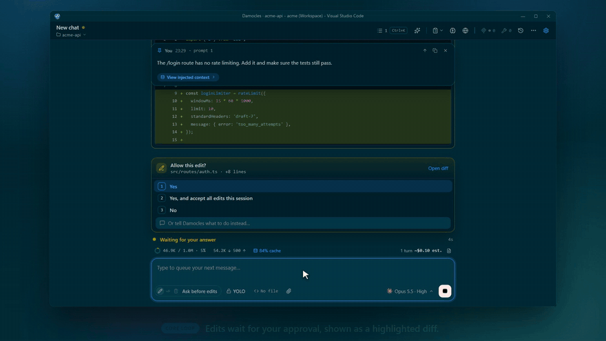

<div align="center">
  
  <h1>Damocles</h1>
  <p>A powerful AI coding assistant, just keep in mind that just because something works doesn't mean it's good.</p>
</div>

## Demo

<div align="center">
  <a href="docs/media/damocles-demo.mp4">
    
  </a>
  <p><em>Diff approval, live shell output, switching a panel's workspace folder, subagents with /steer, teams and /stats. <a href="docs/media/damocles-demo.mp4">Watch the full video</a>, which also covers plan mode, stop and resume, and rewind.</em></p>
</div>

## Features

- **Chat Interface**: Integrated chat panel for conversing with the model, available as a secondary sidebar view (right side) or an editor panel (`Ctrl+Shift+U`). Both modes support all features and can run simultaneously with independent sessions
- **Collapsible User Messages**: Long user-message bubbles collapse by default (canvas and pinned sticky header alike) with a chevron toggle. Expansion state follows the message across inline↔pinned transitions. Drag the handle below an expanded bubble to set the scroll-cap height. The value becomes the global default and persists across webview reloads. The pinned sticky header can also be hidden entirely via the `×` button; when hidden, a small floating pin chip at the top-right of the chat expands on hover to preview the active pinned message and click-to-restore. Hidden state persists globally via `damocles.pinnedHeaderHidden`. The header also steps aside while it would cover more than half the message list, as when a permission prompt docks in a short window, unless you expanded it, and focused or scrolled-to rows land below it while it shows. Queued / injected messages (sent mid-stream) are skipped by the sticky header and never pin
- **Code Assistance**: Get help with coding, debugging, refactoring, and more
- **Syntax Highlighting**: Shiki-powered code blocks with VS Code-quality highlighting and one-click copy
- **Diff Approval**: Review and approve file changes with syntax-highlighted unified diffs (supports concurrent diffs)
- **Inline Diff Preview**: Edit/Write tool results show inline diff previews with click-to-expand full-panel view. Lines carry their real numbers in the file: an Edit's come from the patch pi records, a Write that replaces a file records one too, a new file is numbered from 1, and a change awaiting approval is numbered from the file's current and proposed contents. A Write recorded by an earlier version shows its content without numbers, since nothing says whether it created or replaced the file. A change over 10 MiB or 1,000 changed lines, or to a binary file, shows no numbers rather than invented ones
- **Tool Visualization**: See what tools the agent is using in real-time with expandable details. Each completed tool card shows a subtle duration badge (`123ms` / `1.2s` / `1m 23s`)
- **Live Shell Output**: A running `Bash` or `PowerShell` call streams into a scrolling pane on its card and in the overlay, so a slow build and a hung command stop looking alike. The pane keeps a bounded tail and says when earlier output was dropped. Works in the main session, in subagents and in team agents
- **Stop One Command**: A shell call gets a Stop button that ends that command and its children without ending the turn. A Stop pressed before the command starts, while it waits for a checkpoint or for approval, ends the call at once: the command never runs and its card reads denied. The model receives whatever the command printed, so it can react instead of starting over, and the card reads Stopped rather than taking a success check. Stop can carry a note (Enter sends, Shift+Enter for a new line). The agent reads it in its next step, right after the stopped command's output and before any messages you queued, and answers them in one reply. ESC discards a note the agent has not read yet, and a note sent after the budget limit stopped the turn is not delivered; a warning says so in both cases. The panel interrupt still aborts the whole turn. A shell killed from outside VS Code, by `kill` or Task Manager rather than by Stop, reports the shell convention exit code of 128 plus the signal number instead of reading as a command that succeeded
- **Tool Overlays**: Click tool cards to view full output in a full-screen overlay, including from inside a subagent or team agent overlay; overlays stack in the order you opened them and Escape closes the top one. Supports built-in tools (Bash, PowerShell, Read, Grep, Glob, WebFetch, WebSearch, CodeSearch, FeedRead, YouTubeTranscript, ToolSearch, CronCreate, CronDelete, CronList) with syntax highlighting or markdown rendering, and MCP tools with markdown output. A tool whose result carries images (a Read of an image file, a browser screenshot, an MCP tool) shows them as thumbnails with a click-to-enlarge lightbox, including for subagent and team tools and after a reload. Read overlays show a file metadata card with line range, total lines, and a progress bar for partial reads. Cron tool overlays show human-readable schedules, job IDs, recurring/one-shot badges, and job lists
- **Subagent Visualization**: Nested view of `Agent` tool calls showing agent type, model, tool calls, results, real-time progress summaries, and tokens, cost and cache hit rate that update after each response. Click the agent type or template badge to open its `.md` template. Background agents display a "Background" badge. Stop on a subagent's card or in its overlay ends only that subagent, queued or running: the main agent receives its work so far, marked as stopped by you and resumable, and its turn goes on
- **Background Tasks**: The indicator pill in the status strip under the message box shows how many background subagents are running. It opens a list of their subagent cards, the same cards the chat shows, each with a Stop button while it runs and a Dismiss button once it ends. Click a card to open the subagent. Results appear as labeled assistant messages
- **Streaming Responses**: Watch responses as they're generated
- **@ Mentions**: Type `@` to reference workspace files or agents (`@agent-Explore`, etc.) with fuzzy search autocomplete
- **Custom Agents**: Define custom agents in `.damocles/agents/*.md`, `.pi/agents/*.md` or `.claude/agents/*.md` (project) and `~/.damocles/agents/*.md`, `~/.pi/agent/agents/*.md` or `~/.claude/agents/*.md` (user). Project agents override user agents of the same name, and within one scope `.damocles` beats `.pi`, which beats `.claude`. They run as native nested agents via the `Agent` / `GetSubagentResult` / `SteerSubagent` tools, alongside the built-in `general-purpose` / `Explore` / `Plan` agents; a `run_in_background: true` frontmatter default makes a template always spawn in the background. A subagent runs on **your active panel model** unless its template pins one with `model:`. A subagent on the panel model also runs at the panel's reasoning effort unless its template sets `thinking:`. The spawning agent never picks a model, so that choice stays configuration you control (the `Explore` agent still follows `damocles.explore.*`). A `model:` that doesn't resolve, isn't signed in, or falls outside the `enabledModels` allowlist fails the spawn and names the template to fix, rather than silently running on a different model. An agent whose `tools:` list has no write tool (the built-in `Explore` and `Plan`, or your own) follows plan mode's shell rule in every permission mode: a provably read-only command runs, and anything else (a heredoc, `tee`, `cp`, `npm test`) asks you first, or runs under YOLO. "Read-only" bounds *writes*, not research: such an agent still gets the web tools, the integrated browser tools and your MCP tools (none is write-category), and the built-in `Explore`/`Plan` carry the full browser toolset when `damocles.browser.enabled` is on
- **Steer Agents**: Redirect a running or queued background subagent, or a live team member, mid-task with `/steer`. Pick the target from a live agent picker, type your instruction, and it becomes the agent's top priority immediately (it drops its current approach to follow it). A steer can carry pasted images, with or without text, but not browser elements. The picker lists a team's lead and specialists with their team, role and status, including a member whose session is still opening; the lead sees a specialist's steers when it reviews that specialist. Your steer shows as an amber chip in the transcript and echoes inside the agent's live view; the model can steer its own subagents, but not team members, via the `SteerSubagent` tool
- **Resume Interrupted Agents**: A subagent or team stopped by ESC, a subagent's Stop button, Stop team, `cancel_team`, closing the panel or reloading the window picks up where it left off when you say "continue". Your next message tells the model which agents stopped, why (you stopped it, `cancel_team`, or the panel closed or reloaded), and how to resume each (`Agent({resume})` for a subagent, `resume_team` for a team), and the model resumes only when you ask. A resumed subagent keeps its conversation, model, reasoning level and foreground or background mode, and its new card carries a "Resumed" badge. A resumed team restarts the lead and the specialists that were working, leaves specialists awaiting review parked, and delivers any message a member had not yet received. Damocles does not resume a subagent that the budget limit or a cleared conversation stopped, or an agent that finished or failed
- **Voice Input**: Three modes via `damocles.voice.mode`:
  - **`off`.** Voice disabled, mic button hidden.
  - **`push-to-talk`** (cloud STT). Click the microphone in the chat input to dictate messages. Supports OpenAI Whisper, Deepgram, and Google Cloud STT. Audio is recorded extension-side using native platform APIs (Windows/macOS/Linux) and transcribed via your configured provider. Configure provider, API key, and language in Settings › Voice.
  - **`wake-word`** (local Jarvis), hands-free. Say *"Hey Jarvis, …"* and Damocles transcribes once you stop speaking; optionally speaks the assistant's reply aloud. A Python sidecar runs OpenWakeWord + Silero VAD + Parakeet TDT 0.6B v2 ASR + optional VibeVoice-Realtime TTS. **Fully on-device: no audio bytes or transcript text ever leave your machine.** Wake phrase is stripped before transcription via a two-layer defense (ASR offset + regex). VRAM ~3.7 GB with TTS, ~2.2 GB without; CPU fallback automatic. On Linux/macOS the installer surfaces actionable per-distro commands if a C++ toolchain or PortAudio is missing (`apt install build-essential libportaudio2` on Debian/Ubuntu/WSL, `brew install portaudio` on macOS, etc.); on WSL2 with a CUDA GPU it falls back to `/usr/lib/wsl/lib/nvidia-smi` for driver detection. Full guide: [`docs/voice-jarvis-mode.md`](docs/voice-jarvis-mode.md).

  **Note:** Requires local audio hardware. Not available when connected to a remote host via SSH (the extension host runs server-side where no microphone is present).
- **Image Attachments**: Paste images from clipboard directly into chat (supports PNG, JPEG, GIF, WebP up to 5MB)
- **IDE Context**: Automatically include the active file or selected code in your message (toggleable in input bar); a workspace default (`damocles.ideContext.enabled`) controls whether the chip starts on in new panels
- **Slash Commands**: Type `/` for built-in commands (`/clear`, `/compact`, `/rewind`, `/btw`, etc.) and custom commands from `.damocles/commands/`, `.claude/commands/` and `.codex/prompts/`
- **Prompt History**: Navigate previous prompts with arrow keys (shell-style)
- **Prompt Navigator**: `Ctrl+K` / `Cmd+K` opens a searchable overlay listing every user prompt in the active session. Each row shows index, time, tools invoked during the response, and a kebab menu with Copy / Use as draft / Rewind to here. Type to fuzzy-match prompt text or tool names; arrow keys navigate, Enter jumps to the bubble in the canvas (with a primary-color flash ring), Escape closes. The header chip shows live prompt count plus the platform-correct keybind (`⌘K` on macOS, `Ctrl+K` elsewhere). Each user bubble also exposes the same actions via a hover-revealed kebab so mid-canvas navigation never requires the overlay
- **Session Management**: Create, rename, tag, resume, delete, and search sessions with confirmation. Names/tags persist as in-tree session markers; tags show as badges in the chat header's session history in VS Code and in the sidebar's Chats list in the desktop app. A conversation is open in one panel at a time: opening one that another panel already shows switches to that panel. Deleting a session also removes its plan files and its subagent and team data
- **Panel Persistence**: Panels and active sessions survive VS Code restarts
- **Multi-Panel Sync**: Prompt history syncs across all open panels instantly
- **Context Stats**: The status strip under the message box shows the context window % as a ring, prompt tokens (uncached input, cache read and cache write in the tooltip), output tokens, cache hit rate, turn count and the conversation's total cost. The totals include stopped turns, compactions and cache warming, and a fork counts only what it spent after the fork. Subagent and team spend shows on their own cards. Tokens with no recorded price read "unpriced" rather than $0.00. Context % reflects the last completed request's occupancy (its input + cache). Clicking the ring opens a menu with Compact now and View details, which opens the Context Usage Overlay, a full-screen view with SVG ring chart, stacked category bar, per-category breakdown, collapsible message breakdown (user/assistant/tool calls/results/attachments with per-type drilldowns), detail sections for MCP tools, memory files, agents, system prompt sections, system tools, deferred tools, skills, and slash commands, auto-compact threshold badge reading the threshold in force for the active model, and API usage footer. The system prompt breaks into one row per prompt section (Preamble, Memory, Plan mode, Plan file, Team directive, Project context, Skills, Tone, as each applies), each with its own token cost; hovering a row shows the raw section name. Every tool row is costed by its description **plus** its serialized schema, and each is badged **Loaded** or **Deferred**; the `Tools (deferred)` category is what deferral is saving rather than context you are spending, so it is shown muted and excluded from the stacked bar, which continues to sum to the headline total. Every list is sorted alphabetically (locale-aware, so it follows your active language) rather than by discovery order, so an entry stays where you last found it. The System prompt row and each MCP tool row open their full text, which the desktop app shows read-only in the chat's editor. Also accessible via `/context`
- **Subscription Usage**: `/usage` opens an overlay with a progress bar per rate-limit window for both providers: Claude (session/5-hour, weekly, and the current model-scoped weekly) and ChatGPT/Codex (5-hour + weekly on premium, or a single monthly window on free), each with a live "resets in" countdown, plus extra-usage/credit spend and a GPT plan badge when available. When ChatGPT's usage endpoint does not accept a Sign in with ChatGPT token, the GPT section links to `chatgpt.com/settings/usage` instead. The Claude section also shows an **Account** block read from Anthropic's `/api/oauth/profile`: plan, seat tier, rate-limit tier, subscription status and whether extra usage is on, with your email and organization name masked until you click them (the reveal is never saved and resets when the overlay closes). Read live from each provider's endpoints via your existing subscription OAuth; an API-key login sends no request, and access tokens and your email are never logged. Opens mid-stream and refreshes on demand
- **Usage Statistics**: `/stats` opens an overlay with spend across every project: API-equivalent cost, total and output tokens, cache hit rate, net cache savings, sessions and active days, each with its formula in a tooltip. Filter by preset or custom date range, model and project, and compare against the previous period. A stacked chart shows cost or tokens per day, week or month by model or token type; tables break spend down by model, project and source (main chat, subagents, teams, compaction, cache warming, background tasks); a weekday by hour grid shows when you work; and the ten costliest conversations open on click. Figures come from the session files plus a ledger of internal requests (titles, memory, `/btw`) in `~/.damocles/usage/`, indexed by a worker thread so the first scan does not block the editor. A deleted conversation's spend stays in the totals without its title
- **Session Logs**: The log button in the status strip, or Session log in the chat header's More menu, opens the raw JSONL session file. Each subagent and team member has its own pi session file in a folder named after the parent session, opened from its card's "Open agent log" or the team card's log link. An agent writes its file once it receives its task
- **Model Selection**: Switch between Anthropic models (Fable 5.1, Opus 5.5 by default, Sonnet 5.5, Haiku 4.5), OpenAI models (`gpt-6-astra` at the head of the group, `gpt-6.1-sol` the recommended default, `gpt-6-luna`), and custom-provider models (StepFun **Step 3.7 Flash**, **DeepSeek V4 Pro / V4 Flash**) from one unified dropdown. All OpenAI models work via Sign in with ChatGPT or an API key. **GPT-6 Astra** has a 272,000-token context window, an April 2026 cutoff, and effort Low/Medium/High/Extra High/Max; its pricing defaults are $10 input, $1 cached input, $50 output, $50 reasoning per million tokens. Per-panel selection plus a workspace-wide default for new panels
- **OpenAI / GPT Backend**: GPT models run natively alongside Anthropic models on pi's `openai` provider, signed in with ChatGPT (bills your ChatGPT subscription) or an OpenAI API key (bills your API account). See "OpenAI / GPT" under Authentication. Per-panel selection with a workspace default. Cost is the price pi records from its own rate table when each request is made
- **Effort Badges**: Each reply shows the reasoning effort it ran at (for example "High"), once per turn on the turn's first reply and again only if the effort changes within the turn. Subagent cards, team lead and specialist cards and their overlays show each agent's effort beside its model. The value is the level pi actually ran at after fitting it to the model, so a subagent asked for Max on a model whose top level is High shows High, and Ultracode shows as Max. Models that do not reason, and conversations and team logs recorded before this version, show no badge
- **Image Generation**: An opt-in `GenerateImage` tool (`damocles.imageGeneration.enabled`, off by default and settable only in user settings) creates a new PNG, JPEG or WebP file at the path you approve from a text prompt, using an OpenRouter image model you pick in Settings (`damocles.imageGeneration.model`, also user settings only) and your OpenRouter key, which you can save under OpenRouter Authentication in Settings without turning on the Explore agent. Only models whose cost pi can track are offered. The agent loads it with ToolSearch when it needs it. It goes through the same permission gate as Write: it asks with the path, the prompt and the model in Default mode, runs without asking in Accept Edits, is blocked in Plan mode, never overwrites a file, and a rewind removes the image. The cost OpenRouter billed counts in the status bar, the budget and `/stats`, under the image model. The generated image shows in the tool's overlay. Subagents and team agents do not get the tool
- **StepFun / DeepSeek Backends**: StepFun (Step 3.7 Flash, step-plan flat-fee subscription) and DeepSeek (V4 Pro / V4 Flash, per-token metered) run natively as main-dropdown models. Each has a dedicated API-key panel in Settings; keys live in SecretStorage and reach pi via the native custom-provider path (no reload). Selecting an unauthed model emits a "Sign in to {provider}" toast. The StepFun key is shared with the Explore StepFun provider, one source of truth kept in sync across both UIs. DeepSeek is dollar-budget-enforced like other metered providers; StepFun's flat subscription is exempt
- **Adaptive Thinking (per-panel)**: Model-aware thinking configuration driven by model-reported capabilities. Adaptive models use configurable reasoning effort whose available levels depend on the model: GPT-6 Astra, GPT-6.1 Sol and GPT-6 Luna offer Low/Medium/High/Extra High/Max, the flagship Anthropic models (Fable 5.1, Opus 5.5, Sonnet 5.5) add **Ultracode** as a top tier above Max, and StepFun Step 3.7 Flash offers Low/Medium/High; legacy models use the classic toggle + token budget (1K-64K). **Ultracode** is the highest reasoning-effort level (maximum thinking); selectable per-panel or as a default for new panels (listed after Max), and applies only to those flagship Anthropic models (not to OpenAI/Codex models). The **Max** level is native as of pi 0.80.6 and available on GPT-6 and the adaptive Claude models. Each panel has independent reasoning state: a `thinkingDisabled` flag plus a per-(panel, model) matrix of effort and max-tokens, so switching models within a panel preserves prior intent. A model with no stored effort runs at its catalog default where it has one (High on Opus 5.5 and Sonnet 5.5). The disable-thinking switch is hidden on OpenAI models, which are driven by effort alone, and on Fable 5.1, Opus 5.5, Sonnet 5.5, GPT-6 Astra and GPT-6.1 Sol, which always think and show a note that effort is the control. Flip back to a previously-configured model and its effort/tokens restore automatically. Settings' **This chat** and **Defaults for new chats** sections each have a reasoning block, and the two track different model dimensions independently, so switching the active model in This chat never drags the defaults section's effort capabilities along with it. Workspace defaults persisted via `damocles.thinkingDisabled` / `damocles.effortByModel` / `damocles.maxThinkingTokens`. Thinking blocks always visible (`display: 'summarized'` overrides the API's `omitted` default on Fable 5.1, Opus 5.5 and Sonnet 5.5)
- **Per-Panel Permission Mode**: Each panel can have its own permission mode independent of the global default. The mode button, Shift+Tab and YOLO also work while the agent works. A change applies from its next tool call, and switching into or out of Plan mode tells the agent, and any running team agents, at their next step.
- **YOLO Mode**: Toggle to auto-approve all tool calls (except plan approval and questions). Ephemeral per-panel setting that resets on session clear; a workspace default (`damocles.dangerouslySkipPermissions`) seeds it for new panels.
- **Custom Permission Rules**: Define persistent allow/deny rules for tools in Claude Code CLI-compatible settings files. Rules support pattern matching (e.g., `Bash(git:*)`, `Edit(*.ts)`). Permission prompts include "Always allow" and "Always deny" options that save rules to your chosen settings file.
- **Hooks**: Run your own command at key moments: before/after a tool, on prompt submit, on completion, or when the agent is waiting for approval, via a config-driven `.damocles/hooks.json`. The contract is Damocles' own: the child gets one JSON object on stdin (snake_case keys, a uniform tool schema) and replies with one JSON object on stdout (`{"decision":"deny"}` to block; a non-zero exit never blocks). A `tool_call` hook can block, force-allow, or rewrite a tool call (and optionally end the turn with `"terminate": true`); activation is by presence (no toggle), gated by workspace trust, and every block/force-allow is logged and surfaced in chat. Full guide: [`docs/hooks.md`](docs/hooks.md).
- **Accept All Edits From Any Prompt**: "Yes, and accept all edits this session" on an edit prompt, whether the chat's own, a subagent's or a team agent's, switches the chat to Accept edits, so every agent's later file edits run unasked while shell commands still ask. Edit prompts already open that the new mode would not ask about close as approved, and turning YOLO on or changing the mode does the same.
- **Plan Mode**: When enabled, the agent creates implementation plans for your approval before making changes. Plans are decomposed into **vertical slices**, each cutting end-to-end through every layer to deliver one small, independently testable behavior rather than horizontal layers. Review plans in a modal, approve with auto-accept or manual mode, or request revisions with feedback. Dismissing the overlay (Escape) hides it without canceling. Click the tool card to reopen, or press Escape again to reject. While planning, the agent writes and continuously maintains its plan as markdown at a deterministic per-session path (`~/.damocles/plans/<slug>-<id8>.md`), the only native write permitted in plan mode (read-only shell commands such as git status/log/diff, ls, cat, grep, and `cd`, plus stdout-only readers like `tac`/`rev`/`od`/`strings`/`base64`/`column`, run without asking. `cd <dir> && <read-only command>` works and output may be discarded with `2>/dev/null`, `>/dev/null`, or `>/dev/null 2>&1`. Any other shell command asks you first, or runs under YOLO, so the agent can query a service or read logs while planning. Every Edit/Write outside the plan file stays blocked, YOLO included). Enabled MCP tools remain fully available while planning, so the agent can still look things up (e.g. Context7 docs). The per-server enable/disable toggle is the control. The integrated browser's tools are available while planning too when `damocles.browser.enabled` is on, so research can drive a running app or a live page. Plan mode's guarantee is no unapproved workspace writes and no unapproved shell, not "no side effects anywhere", and it now states what it *blocks* rather than re-listing what it permits, so a newly added tool subsystem is usable while planning by default. That file is the single source of truth: the approval overlay, the saved plan, and the implementation handoff all read the full plan from it (approval is blocked until the plan file is written), and the completed plan card's **View plan** button opens it. View the session plan anytime from the chat header's Plan menu. Plan mode also deterministically funnels every turn through `ExitPlanMode`: if the agent stops without exiting, it is automatically nudged to call `ExitPlanMode`, ask via `AskUserQuestion`, or keep planning, so a plan turn never ends silently without your approval (press Stop or leave plan mode to break out)
- **Clear Context & Auto-Accept**: Plan approval option that clears conversation context and starts fresh with the plan injected (matches Claude Code CLI behavior). Preserves planning session as reference while implementation runs in a clean session. The overlay header shows a context usage badge with threshold-based colors so you can make an informed decision
- **Bind Plan to Session**: Inject a custom plan file into the session from the chat header's Plan menu › Bind a plan file…. It lists up to 8 markdown files in the chat's folder that sit in a `plans` folder or have the word "plan" in their name, newest first, and Browse for another file… opens the file dialog. Binding writes the plan to the session's deterministic plan-file path (overwriting an existing one in place, which the list warns about) and confirms with a toast. No agent turn is spent. The agent reads the plan from that path, which is injected into the system prompt every turn.
- **File Checkpointing & Session Forking**: Track file changes and rewind to any previous state, or fork the conversation into a new panel without touching the source. Three entry points: the Rewind Browser (`/rewind`), the inline rewind button on any user message bubble (hover to reveal), or `Escape Escape`. The Restore Options modal offers three actions: **Fork conversation** (new panel branched at the selected message; source untouched), **Roll back files** (restore the workspace; conversation stays linear), and **Fork and roll back files** (both). The "files affected" list is the **live diff** between the workspace now and the checkpoint, so files you deleted since are flagged for restore; clicking a file opens a side-by-side diff. This is backed by one shadow git repo per folder, shared by the folder's conversations and kept entirely separate from your real repo. A turn's first checkpoint runs in the background, so the reply streams at once; only tools that change files wait for it, up to `damocles.checkpoints.baselineWaitSeconds`, after which the tool runs and that turn is marked not rewindable. Video, audio, archives, disk images, model weights, Git LFS files and any file over `damocles.checkpoints.maxFileSizeMB` are left out of checkpoints, and so are build and cache folders except for files your project's git tracks there. The rewind view lists what a checkpoint left out under "Not restored by this checkpoint", and a rewind never changes, deletes or restores those files. A rollback first saves your current files, and the Rewind Browser lists each saved state with **Undo rewind** to put them back. A hard restore recreates deleted files and drops ones created after. Forked panels inherit the source's settings, hydrate history up to the fork point, and pre-fill the rewound prompt. A fork also copies the subagent and team data its conversation had at the fork point, so agent cards keep their history and an interrupted agent, including a team cancelled before the fork, can be resumed in the fork. A background sweep (shortly after activation, then roughly daily) keeps these shadow repos small, repacking each one so per-turn snapshots delta-compress (rewind history stays fully intact) and removing the checkpoints of any conversation idle beyond `damocles.checkpoints.retentionDays` (default 30; `0` keeps history forever). A chat with no project folder (no folder open in VS Code, no project loaded on the desktop) runs in your home folder and takes no file checkpoints: each prompt still rewinds and forks the conversation, and the rewind view says why its file options are off
- **Rewind to Before Compaction**: After a conversation is compacted, recover the full pre-compaction context. The compaction boundary card carries a **Rewind to before compaction** action, and compaction points also appear in the Rewind Browser (`/rewind`) alongside prompt anchors. Because Damocles captures a workspace snapshot at each compaction, a compaction point is a **full rewind anchor**: selecting one (from either entry point) opens the Restore Options modal with file counts and per-file diffs, so you can roll workspace files back to the at-compaction state, fork the complete un-summarized conversation into a new panel, or do both. The picker marks these anchors with a file-count badge. Older sessions with no captured snapshot keep the conversation-only fork (source untouched). Works for manual (`/compact`) and automatic compaction, on live and resumed sessions. A confirmation notes that turns taken after the compaction aren't carried over and that the restored (large) context may re-trigger auto-compaction
- **Side Questions (`/btw`)**: Ask ephemeral side questions that share conversation context without interrupting the main session. Token-efficient via prompt caching, so only the question and response are new tokens. Responses appear in dismissable inline aside bubbles with markdown rendering, visually distinct from the main conversation. Not persisted to session history
- **Message Queue**: Send messages while the agent is working. Each shows as a chip, and everything queued reaches the agent together at its next tool boundary. ESC, or the budget limit stopping the turn, puts undelivered messages back in the input box, images included. A UserPromptSubmit hook checks each queued message once, when you queue it, and a message it blocks leaves the queue with the hook's reason shown
- **Parked Session Indicator**: A session waiting on you reads as waiting, not as working. A run parked on a tool approval, an `AskUserQuestion`, a browser input request, a plan or skill approval, or an MCP elicitation shows a pulsing warning indicator and returns to working the moment you answer, including for a dialog raised by a team agent
- **Manual Compaction (`/compact`)**: Summarize the conversation on demand to reclaim context, optionally focusing the summary with an instruction (`/compact <instructions>`). Gated to idle. Finish or stop the current turn first. The compaction boundary and restored context surface inline in the chat
- **Auto-Compact**: Optional automatic context compaction (`damocles.autoCompact`; opt-in, disabled by default). Triggers a compaction once context usage crosses `triggerPercent` of the window to prevent overflow. Applies uniformly to every provider. GPT sessions compact only when you enable it, same as Anthropic
- **Per-Model Compaction Budgets**: `damocles.autoCompact.modelOverrides` gives one model its own budget, keyed by the model value the picker uses (e.g. `claude-opus-5-5`) and applied only while that model is active. An entry may set `triggerPercent` (50-95), `keepRecentPercent` (1-50), or both; omitted values fall back to `damocles.autoCompact.triggerPercent` and to pi's own default respectively. Out-of-range and non-numeric values are clamped rather than passed through
- **Compaction Transparency**: The transcript says what a compaction did. A boundary card names the trigger (manual, threshold, or overflow) and, with `damocles.showCacheMissNotices` on, what the compaction itself billed. A compaction that aborted or failed leaves a card saying so and whether a retry is coming, instead of clearing its banner in silence
- **Prompt Cache Warming**: Shortly before the provider drops the cached prompt, Damocles re-sends the last request with a one-token output budget, so the next real request is a cache read instead of a full rebuild. It only fires when the expected saving clears pi's threshold, which small contexts and cheap models often miss. A warm request bills as a cache read of the full context plus one output token, never enters the conversation, adds no turn to the turn count, and counts in the conversation's total cost and in `/stats` under Cache warming. `damocles.cacheWarming` picks the mode: `streaming` (the default) warms only while a run is in flight, `idle` also warms for up to 30 minutes after the last request, `off` lets the cache expire. Warming stops when the panel closes or the session's budget cap fires, because it bills against that same cap. The setting is application-scoped, so it lives in user settings and a repository cannot turn it on from `.vscode/settings.json`
- **Persistent Memory**: Every memory has a **kind** (`fact`, `preference`, `observation`, `note`, `episode`) and a **scope** (`session`, `project`, `global`), stored in SQLite via Node's built-in `node:sqlite` (WAL mode, `~/.damocles/memory.v3.db`; your v2 data is imported once on first run). No native modules or WASM, so it works cross-platform without compilation. Memories survive compactions and sessions, giving the agent continuity across conversations. Uses **delta injection behind a relevance gate**: each memory reaches the model at most once per context. Pinned, session and preference memories come without needing to match; everything else comes only when it is relevant to a prompt, the strongest matches in full and the rest as one-line summaries the agent can expand with `get_memory_details`, so a follow-up prompt usually adds nothing or a few hundred tokens
- **Automatic Memory Extraction**: After a conversation goes idle (or on session switch), a background pass extracts durable facts, preferences, and episodes from the turns, deduping exact and near-duplicate content, resolving contradictions, and decaying time-bound episodes (~30-day TTL, promoted when reused), so memory accrues without manual `/remember`. Runs on a cheap model; crash-safe (a batch is never lost mid-extraction). Gated by `damocles.memory.autoExtract.enabled`
- **Fact Graph & Versioning**: Facts evolve through `UPDATES` / `EXTENDS` / `DERIVES` / `SUPERSEDES` edges. When a fact is updated the old version is retained (not deleted) and browsable via `get_memory_history`; `get_related_memories` traverses the graph. `forget_memory` drops a memory by id or content, by default forgetting the entire version chain so an older version cannot resurface
- **User Profile**: A short auto-maintained summary of you: a static section plus a recent-activity dynamic section, per project and global scope, regenerated during consolidation and injected once per context, and again after compaction. Edit it inline in the Memory Panel; budget via `damocles.memory.profile.tokenBudget`
- **Pinned Memories**: User-designated memories injected in full once per context, bypassing the relevance gate. Pin/unpin via the overlay UI. Configurable budget (default 500 tokens)
- **Retrieval Tracking**: When the agent fetches, inspects or updates a memory by id (or you paste its id into a prompt), the retrieval is recorded and fed back into injection ranking. Memories the agent actively uses rank higher later, a closed feedback loop
- **Observation Staleness**: When source files referenced by an observation are modified, the observation is automatically marked stale. The agent sees `[stale]` tags in context and can verify whether the observation is still accurate, then mark it fresh via the `reset_observation_staleness` MCP tool
- **Memory Commands**: `/remember <text>` saves session memory (prefix `project:` or `global:` for broader scope), `/note <text>` saves to a searchable knowledge base, `/memories` opens the management panel
- **Observations**: The agent voluntarily records rich observations via MCP tool after significant work, as structured entries with type, title, narrative, facts, tags, and file paths. Zero additional API cost
- **Memory Tools**: 12 native in-process tools for the agent: `save_memory`, `save_observation`, `search_memories` (semantically reranked), `get_memory_details`, `get_memory_history`, `get_related_memories`, `update_memory`, `forget_memory`, `unforget_memory`, `save_note`, `list_notes`, `reset_observation_staleness`. Progressive disclosure keeps token usage efficient
- **Memory Panel**: Full-screen overlay for browsing, creating, deleting, pinning/unpinning, forgetting, and searching memories, with kind/scope filter chips, a forgotten toggle, version-history and related-memories dialogs, and an inline editor for the auto-maintained user profile. Each row marks a pinned memory, a stale one (its files changed 3 or more times since it was recorded, the same rule the injection gate uses), how many times the agent used it, and its version
- **Consolidation Panel**: A header pill beside the prompt navigator opens a live view of the consolidation pipeline, a five-phase stepper (Claim → Extract → Persist → Maintain → Profiles) with honest progress (indeterminate sweep for the slow Extract LLM call, a determinate `x/y` counter for Persist), the conversation turns queued for the next pass, and the last pass's extracted memories with outcome badges, an Auto/Manual trigger chip, and a relative timestamp. A failed pass shows a distinct failure card with **Retry now** (and **Sign in to a model** when no extraction model is authed), separate from the neutral "nothing new to remember" state; failures also surface as an error dot on the toolbar icon while the overlay is closed. A **Run now** button triggers consolidation manually. Memory extraction runs on your Settings → Explore model (falling back to the provider-matched small/fast model)
- **Injected-Context Viewer**: Each prompt has a "View injected context" pill that opens an overlay showing what was added for that prompt, why, what was already in context from earlier prompts, and the exact text the model received. Each memory shows why it was included, with the matched words highlighted, and a ranked memory shows its score; a "Reranked" badge marks a prompt whose matches a model reranked. The overlay also shows the query terms, the profile and the Compass status, and you can pin, forget or open a memory in the memory panel from its card
- **Collaborative Teams**: Multi-agent team system where 2-5 specialist agents collaborate in real-time on complex tasks. A lead agent orchestrates by spawning specialists with domain expertise profiles, coordinating via direct messaging, sharing decisions on a scratchpad, and synthesizing a final result. `create_team` takes a required **`brief`** (the authoritative statement of what to build and why) alongside a short `title` label; the brief is seeded verbatim into an immutable `mission-brief` scratchpad section before any agent spawns, and the lead can't spawn a specialist until it has read it, so the authoritative intent always reaches the whole team instead of the lead inventing an architecture. A specialist that finds anything in conflict with the brief **hard-stops** and flags it (`team_flag_brief_conflict`); the lead reconciles it (revise or dismiss-with-rationale) or escalates the fork to you via `AskUserQuestion`. A flagged conflict can never be silently dropped: synthesis is mechanically blocked while one is open, and any completion that still carries an unresolved conflict is prepended with a prominent "⚠️ UNRESOLVED BRIEF CONFLICTS" block. The lead spawns each specialist with a `kind` (`implementor` or `reviewer`) that selects which role settings apply. **You** choose the model and reasoning effort per role (lead / implementor / reviewer) via the six `damocles.team.*` settings. The AI never picks team models. Leave a model empty to use the active panel model, and leave an effort empty for the model default. Any catalog model works for any role, including across providers (e.g. reviewers on a different model than implementors); a role configured to a model whose provider isn't signed in fails team creation up front with a clear message naming the setting and model. The engine guarantees liveness without timers: a specialist can't silently end its turn without reporting (it's nudged, then forced into review where the lead can revise or approve it), messaging a dead or unspawned agent fails loudly with recovery guidance, the lead can re-run a failed or cancelled specialist with `team_redispatch_specialist` (same card, transcript preserved), and a lead that abandons an open review round gets bounded re-notifications before the team force-completes with a clearly marked partial result. A team run always returns. 91 bundled agent profiles across 8 categories (Engineering, Design, Testing, Security, Product, Project Management, Specialized, Game Development) give specialists genuine domain knowledge. Agents don't interrupt each other: a scratchpad write wakes only a specialist parked in `standby`, while a working agent pulls shared state when it needs it. The Timeline still records every write. Both terminal tools end the turn from the engine rather than trusting the model to stop, so a parked specialist costs nothing until a teammate wakes it, and `team_report_complete` carries the sign-off as an argument instead of paying for an extra request to write one. Re-reading a scratchpad section at a version you already hold returns a short marker instead of its text. Each role is registered only for the tools it can call, 13 for the lead and 9 for a specialist. Cost on each card is labelled by the model that agent actually ran on, and on a flat subscription it reads as an estimate (`~$0.42 est.`) rather than a charge. A shared **verification ledger** (`team_record_verification`) lets one agent's test run count for the whole team: each entry is stamped with a fingerprint of the working tree that **Damocles computes from git**, never the agent, so a peer can skip a provably redundant run, and any edit changes the fingerprint, so a stale pass can never be reused. Cross-review follows the lead's contract, so specialists whose work never touches don't manufacture feedback for each other. Each `create_team` and `resume_team` call gets its own TeamCard in chat, showing that run's status, time, tools, tokens, cache hit rate and cost, and only the running call's card is live; TeamOverlay provides full details (Agents, Timeline, Scratchpad, Result tabs). An agent waiting for your approval shows "Needs you" on its chip, the team card and the team view. Stop team, on the running card and in the overlay, asks first and names the agents still working, then stops the whole team, leaving it resumable, and hands the main agent the partial results so its turn goes on; the lead's own Stop does the same. Each agent's tool calls render as full cards with readable names (`Write scratchpad`, not `team_write_scratchpad`), live shell output and a Stop button, and they open into the tool overlay like any other card. All agent communication and every tool result is persisted to JSONL, so a team reopened from history shows what each tool returned. Each Damocles panel owns its own team runner, so multiple panels can run independent teams concurrently without cross-interference. Disabled by default; enable via `damocles.team.enabled`
- **Compass, the workspace knowledge graph**: Converts your workspace into a persistent, queryable knowledge graph via tree-sitter AST extraction across 15 languages (Python, JS/TS/TSX, Go, Rust, Java, C, C++, Ruby, C#, Kotlin, Scala, PHP, **Vue SFC**). Backed by SQLite via Node's built-in `node:sqlite` (FTS5), so the graph survives VS Code restarts with zero re-indexing. The agent queries the graph via 8 MCP tools: **core** (`compass_search`, `compass_query`, `compass_context`, `compass_stats`), **impact** (`compass_blast_radius`, `compass_review_context`), **analysis** (`compass_dead_code`), and **admin** (`compass_build`). `compass_review_context` auto-detects changed files via git when no file list is provided. Every `compass_query` response states what the target resolved to (name, kind, `path:line`), lists alternate matches on ambiguity, and flags empty relationship results for verification, so a "none" is diagnosable rather than silently wrong. Key capabilities: FTS5 BM25 search with camelCase/snake_case tokenization (plus parent-class and directory tokens, so a query naming a class surfaces its methods), blast radius analysis (BFS from changed files through all edge kinds, bounded non-lossily on hub nodes), risk-scored review context (flow-criticality-weighted impact + test gaps + affected flows, with a context-savings estimate), test-coverage edges (`tests_for` / test-gap risk, derived from tests that call production code, recognizing Rust `#[test]`, PHPUnit camelCase, and `@Test`/`[Fact]`-family annotations, with a class-name fallback for DI-heavy tests), dead-code detection (unreferenced functions/classes, excluding entry points and framework-managed classes; constructor/static calls and type-hint/DI-injected dependencies are now tracked across all languages, so constructor-injected services aren't false-flagged), execution flow tracing with criticality scoring (framework decorators and entry-name conventions across 15+ stacks; test files excluded from production flows), and Louvain community detection (adaptive resolution scales inversely with graph size; directory-based fallback above 20K nodes). Interactive D3 force-directed graph visualization in the webview with community coloring, blast radius overlay, and click-to-navigate. VS Code sidebar tree view, search panel, validation panel (broken edges, orphans, stale files), editor gutter decorations for blast radius, and status bar. Incremental updates are watcher-fed, so newly created files are indexed within seconds without a rebuild (large bursts like branch switches fall back to one git diff), with SHA-256 caching, transitive dependent invalidation, and a WAL checkpoint skipped when the graph hasn't changed. Resilient by design: a corrupt graph cache self-heals on startup, and repeated worker crashes trip a circuit breaker ("Compass failed. Run Rebuild to retry") instead of looping. Works correctly on Windows (drive-letter casing, `/`-style `excludePatterns`) and in monorepos where the workspace is a subfolder of the git repo. All tools support `detail_level` (minimal/summary/full) for token efficiency. Withheld entirely in a workspace you have not trusted, because indexing reads every file in the tree and runs git inside the repository, where the repository's own `.git/config` decides what git executes; in that state there is no index, no file watcher, no sidebar views and no Compass tools, and granting trust starts it with no window reload. Disabled by default; enable via `damocles.compass.enabled`
- **Damocles Browser**: Integrated browser automation. In VS Code every open page is its own editor tab with its own toolbar (back, forward, reload, URL bar, element picker, DevTools, new tab), so you can split or drag browser tabs like any other editor and both panes keep rendering live. In the desktop app a conversation's pages open in a side pane beside it, with page tabs and the same toolbar: the pane opens without taking the cursor out of the message box, resizes by dragging its divider, collapses with `Ctrl+Shift+B` (`⇧⌘B` on macOS), maximizes to fill the chat area, overlays the chat on a narrow window, and brings its pages back after a restart; a conversation with open pages stays loaded, and deleting the conversation closes its pages. Runs on **Patchright**, a stealth-hardened Chromium/Playwright engine that never calls `Runtime.enable` (the biggest CDP automation tell), scrubs the automation user-agent, and drives interactions through Playwright locators, so bot-protected pages load normally. The agent gets a full tool set for navigation, interaction (click, type, fill, select, hover, drag, upload), and reading (screenshot, DOM query, snapshot, evaluate), plus multi-tab control (`BrowserTabs` for list/open/switch/close), file downloads (`BrowserDownloads`), and request interception/mocking (`BrowserIntercept`). **`BrowserRequestInput`** asks *you* to fill a form (login, MFA/OTP, payment) whose values are injected straight into the live page and are never seen by the model, logged, or persisted. Press Enter or click Submit. Each subagent and team agent drives its **own isolated tab** (the main agent and you share the primary one; in the desktop app each conversation has its own), so concurrent agents never clobber each other's page: `BrowserTabs` and `BrowserClose` only see the calling agent's tabs, and an agent's tabs close automatically when it succeeds but stay open after a failure so you can inspect the page. Element picker attaches DOM/CSS/screenshot context to chat. `BrowserConsole` reports what the page actually logged, captured by an in-page bridge, since the CDP console API is one of the automation tells Patchright disables. It also reports any `alert`/`confirm`/`prompt` Damocles auto-answered on the agent's behalf, so an accepted dialog is never silent. Everything a page produces is **credential-redacted at capture**: values under credential-shaped keys and self-identifying token formats (JWT, `Bearer`, PEM keys, vendor-prefixed keys) never enter the transcript or the session file, and a picked password field is masked rather than attached. Each tab shows the live title and favicon; a self-healing screencast watchdog recovers a stalled view, and if Chrome exits unexpectedly the browser tabs close with a notification. Pages a site opens itself, `window.open` and `target="_blank"` links, are captured as tabs. Disabled by default; enable it in Settings › Tools & integrations or via `damocles.browser.enabled`. **DevTools port:** off by default. `damocles.browser.devToolsPort` launches the browser with a DevTools debugging port, an unauthenticated loopback endpoint that any local process can attach to and drive the browser as you, with your logged-in profile. It exists only to power the toolbar's DevTools button, and a relaunch is required because it is a launch-time Chromium flag. **Known limitation:** popup-based "Sign in with Google" / Apple / Microsoft windows attach as tabs but headless Chromium does not paint popup surfaces ([Chromium 696439](https://crbug.com/696439)), so there is nothing to click; same-window OAuth that redirects the parent page is unaffected. For popup providers, sign in via your normal browser before bringing the URL into the panel.
- **MCP Elicitation**: MCP servers can request user input during tool execution. Form mode renders JSON Schema-driven fields for structured input, URL mode opens an external browser for OAuth flows. Prompts appear above the chat input with Accept/Decline actions. A prompt raised during a **subagent's or team agent's** call renders in the spawning panel, labelled with the agent that asked; concurrent agents queue one at a time, and an agent that ends withdraws its own prompt. With two calls in flight on one server the dialog names only the server, because MCP cannot say which call elicited
- **MCP Server Management**: The MCP client is pi's own (`@earendil-works/pi-mcp`); Damocles runs the servers and shares each one across every chat of a folder. Servers are merged from eight sources, each row badged with where it came from, lowest precedence first: read-only imports of your Claude Code / Claude Desktop config and of `~/.codex/config.toml` (ties broken by `damocles.assetSourcePrecedence`), then pi's own `~/.pi/agent/mcp.json` (badge `pi`), then the project's `.pi/mcp.json` (badge `pi-project`), then Claude Code's **local** scope for this project (what a plain `claude mcp add` writes, under `projects[<workspace>]` in `~/.claude.json`), then your own `~/.damocles/mcp.json`, then the project's `.mcp.json`, then your personal `<workspace>/.damocles/mcp.local.json`, which wins. **Add, edit and delete servers from the panel**. Only `~/.damocles/mcp.json` is ever written, so every other source is read-only and carries no Edit/Delete button. `~/.claude.json` is deliberately not watched, because Claude Code rewrites it continuously and each write would cycle your live connections, so the panel has a **Reload config** action that re-reads every source on demand. `.damocles/mcp.local.json` is meant to be personal and gitignored; when git is not ignoring it the panel warns and names the line to add, the warning clears as soon as you add it because `.gitignore` is watched too, and Damocles never edits your `.gitignore` itself. The check is skipped in a workspace you have not trusted, because running git there would run configuration the repository ships, and it gives up after ten seconds so a wedged filesystem cannot hold up session start. In a workspace you have not trusted, `.mcp.json` and `.damocles/mcp.local.json` servers are listed with an untrusted badge and do not connect, `.pi/mcp.json` is not read until you trust the folder, and the rest still connect. A config file that exists but cannot be parsed is reported by name and line with a button to open it at the fault, rather than its servers silently disappearing. Servers connect over stdio or streamable HTTP. Legacy SSE servers are not supported and show an error row asking for the server's streamable HTTP URL; an `auth.provider` entry shows an error row too. stdio servers get a minimal default environment plus their own `env`, never your whole environment, so your provider API keys reach a server only when its config names them. Each tool is exposed under pi's name, `mcp__{server}__{tool}` with every character outside `[A-Za-z0-9_]` replaced by `_` and capped at 64 characters (a colliding or longer name gets an 8-character hash suffix), so `resolve-library-id` becomes `resolve_library_id`. Permission rules naming a renamed tool are migrated in `~/.damocles/settings.json`, `~/.damocles/settings.local.json` and a folder's `.damocles/settings.local.json`; rules in a project's committed `.damocles/settings.json`, hook matchers, agent `disallowed_tools` and project-scope `damocles.tools.disabled` entries naming a renamed tool are listed once in a notice for you to edit. Claude Code's settings files are left alone, because Claude Code keeps `-` in MCP tool names. Two servers whose names differ only in such characters are one server: the lower-precedence one is dropped and reported. Config fields follow pi's `mcp.json`: `description` (the server's ToolSearch menu line, else the first line of the server's own instructions), `timeout` (seconds per request, default 120, reset by progress notifications), `enabled: false` (listed as disabled until you enable it in the panel), and `oauth.clientName`, `oauth.authServerMetadataUrl`, `oauth.callbackUrl` and `oauth.callbackPort` (a fixed loopback redirect URI for a pre-registered OAuth client, sent exactly as written). Values in pi-format files (`~/.damocles/mcp.json`, `.damocles/mcp.local.json`, `~/.pi/agent/mcp.json`, `.pi/mcp.json`) follow pi's rules in `env`, `headers`, `bearerToken` and `oauth.clientSecret`: `$VAR` and `${VAR}` read an environment variable (`$$` is a literal `$`, `$!` a literal `!`), a value starting with `!` runs a shell command and uses its output, like a credential helper (`"!op read op://vault/mcp/token"`; Git Bash or your configured shell on Windows, 10 s timeout, run again on every connect), and a variable that is not set marks the server failed, naming the variable, instead of sending an empty value. A folder's file runs commands only in a trusted workspace. In `.mcp.json`, Claude and Codex configs a leading `!` is plain text and `${VAR}` and `$env:VAR` keep their meaning. A stdio server runs in its folder (a user server in your home directory) unless `cwd` says otherwise, and a relative `cwd` resolves against that same directory; pi does not expand variables in `cwd`, so in a pi-format file a `cwd` holding `${VAR}` or `$env:VAR` marks the server failed. Existing `$env:NAME` values and `oauth.redirectUri` in your two Damocles files are migrated to `${NAME}` and `oauth.callbackUrl` automatically; any other `$` or leading `!` in an old value now has pi's meaning. A tool result longer than 20 KB is cut in the middle, and its full text is saved to a temporary file named in the result, so the agent can Read it. OAuth uses PKCE with dynamic client registration (as `oauth.clientName`, default `Damocles`), rejects a sign-in answered by a different authorization server (RFC 9207 `iss`), and asks you to authenticate again when a server needs more scope than you granted. Known issue in pi-mcp 0.99.2: an authorization server whose token or registration response holds an empty field such as `"scope": ""` cannot sign in until a pi-mcp release with the fix ships. Each tool row in the MCP panel has an **Off / On / Always loaded** control and names where its state comes from (Config, User, Project or Local). On is the default: the agent loads the tool with ToolSearch when it needs it. Always loaded declares the tool from the first turn, which costs context on every turn, and the first prompt of a session waits up to 10 seconds for a server with such a tool to connect; stopping the turn, starting a new chat or resuming another conversation during that wait sends nothing to the model and puts your message back in the composer. The choice is saved to `damocles.mcp.toolExposure` (`{ "<server>": { "<tool>": "off" | "deferred" | "direct" } }`) at the scope picked in **Save to** at the top of the panel (User, Project, or Local on desktop); local beats project beats user per tool, and project and local apply only in a trusted folder, so a save that a higher scope still overrides for that tool says so. A change to the setting made anywhere, such as `settings.json`, Settings Sync or another window, applies to every open chat from its next turn. On desktop, Project and Local are saved to the default project, so they are offered only when it is trusted too. A server's `exposure` and `toolExposure` fields in `mcp.json` (pi's values, `*` patterns allowed) give the starting state. Tools you disabled before this version stay off. Enabled servers are **supervised**: they stay connected for the session and auto-reconnect when a connection drops, with a crash-loop throttle and config-change re-validation so a reconnect never resurrects an orphaned child process. Opt out per server with `lifecycle: "lazy"` (connect-on-use) or an explicit `idleTimeout`. Enable/disable servers from the UI, persisted to Damocles workspace state. Disabling a server from `~/.damocles/mcp.json` or an imported Claude Code, Claude Desktop or Codex config applies to the whole window (`damocles.mcp.disabledServers`). Disabling a project server, one from the folder's `.mcp.json`, `.damocles/mcp.local.json` or Claude Code local scope, applies to that folder only (`damocles.mcp.disabledProjectServers`). The whole subsystem toggles via `damocles.mcp.enabled`. Status panel shows per-server tool counts with expandable details and annotation badges (read-only, destructive, network), error messages for failed servers, and per-server actions: reconnect, authenticate, and, on a connected OAuth server, **Re-authenticate** (clear the token and log in fresh) and **Sign out** (clear the token and disconnect). Sign-out evicts the server's cached tools so the agent can no longer call them and best-effort revokes the token server-side (RFC 7009) where the auth server supports it
- **Web Tools** _(opt-in)_: Five native, **key-free** read-only tools: **WebSearch** (an answer with cited sources, with optional category / domain / publish-date filters via Exa's advanced search), **WebFetch** (read a web page or PDF as markdown, with `raw` / `maxChars` / `includeLinks` / `includeImages` controls), **CodeSearch** (search public source code and docs), **FeedRead** (read an RSS 2.0 or Atom feed as markdown), and **YouTubeTranscript** (best-effort video transcript when captions are available, though YouTube may block it). WebSearch/CodeSearch are backed by Exa's free endpoint; no API key or config required. WebFetch extracts HTML via Readability, reads PDFs inline, and falls back to the `r.jina.ai` reader for JavaScript-heavy pages; every outbound fetch is validated to block internal/loopback/cloud-metadata addresses. All five are read-only, available in plan mode and inherited by `tools: *` subagents. They start **deferred**: their schemas are not in the prompt until the agent loads them with `ToolSearch`, so a turn that never searches the web costs nothing for them. See **Deferred Tool Loading**. Enable via `damocles.pi.webSearch.enabled`; the toggle takes effect on the next turn with no install or reload
- **Hooks Support**: Claude Code hooks (shell commands that run on events like tool calls) work automatically
- **Deferred Tool Loading**: The browser, Compass, web and MCP tools start registered but **inactive**, so their schemas are not in the prompt on turn one. A conversation that never touches them never pays for them. The agent loads a group on demand with the always-active `ToolSearch` tool, and the tools are callable from its next step. The menu it reads is built from live workspace configuration, so a subsystem you disable mid-session drops out of it rather than staying advertised. What this saves depends on your provider: a tool never loaded always costs nothing, and on Anthropic *loading* a group mid-conversation still reads the cached system prompt and initial tools, so only the new schemas and the messages are written to the cache again. Subagents and team agents resolve through the same deferral, so no agent kind is a hole. `/context` shows the split. See **Context Stats**
- **MCP for subagents and team agents**: Every nested agent gets the panel's full eligible MCP set, deferred like the panel's, and loads a server's tools with its own `ToolSearch`. The grant is **uniform**: `Explore`, a `tools: *` agent and a team specialist all get the same set, because MCP tool names depend on which servers *you* configured, so no template can name them without hardcoding something your config breaks; `disallowed_tools` is the opt-out (exact, case-sensitive). An agent's set is **frozen at spawn**: a server connected mid-run reaches the next agent, not a running one, and a tool its server stops advertising is reported gone rather than worth retrying. Read-only agents reach MCP under the panel's rules, so an annotated read-only tool runs, anything else asks you first
- **Tools Panel**: A status panel listing every agent tool grouped by subsystem (core, memory, compass, browser, web), each with a per-tool enable switch and a per-subsystem master switch. Core built-ins are locked on; memory/compass/browser/web tools toggle. Opens from the Tools button in the chat header (in its More menu when the panel is narrow)
- **Skills Support**: Approve or deny skill invocations. Skills are discovered from your Damocles dirs (project + user `.damocles/skills/`, `.claude/skills/` and `.codex/skills/`) and merged into the slash-command list alongside the built-in commands. `.damocles` wins any name collision; between `.claude` and `.codex`, `damocles.assetSourcePrecedence` decides. In an untrusted workspace the project-scope entries are listed with an untrusted badge and refuse to run until you trust the workspace
- **Localization**: The UI is in English and Greek. VS Code follows its display language until you pick one in Settings › Application › Language, which applies at once. The desktop app follows the operating system's language unless `damocles.desktop.language` (the same Settings row) names one, which applies after Restart now and covers the menus and Chromium's own text

## Installation

1. Clone the repository
2. Run `npm install`
3. Run `npm run build`
4. Press F5 in VS Code to launch the Extension Development Host

## Desktop app

Damocles also ships as a desktop app for Windows, macOS and Linux. It runs the same agent, chat and tools as the extension. In place of VS Code windows, a sidebar lists your projects and the selected project's chats, and the chat you pick fills the window. Download it from the assets of the [latest release](https://github.com/AizenvoltPrime/damocles/releases/latest).

Supported systems: macOS 13 (Ventura) or later on Apple Silicon, Windows 10 or later, and current Linux distributions. Only 64-bit builds exist: x64 and arm64 on Windows and Linux, arm64 on macOS.

### Install

| System | Download | Install |
| --- | --- | --- |
| Windows x64 or arm64 | `Damocles-Setup-<version>-x64.exe` or `Damocles-Setup-<version>-arm64.exe` | Run it. It installs for your user only, needs no administrator rights, and starts the app. |
| macOS (Apple Silicon) | `Damocles-<version>-arm64.dmg` | Open it and drag Damocles to Applications, then approve it as described under "macOS approval". |
| Debian, Ubuntu (x64 or arm64) | `damocles_<version>_amd64.deb` or `damocles_<version>_arm64.deb` | `sudo apt install ./damocles_<version>_amd64.deb` |
| Fedora, RHEL (x64 or arm64) | `damocles-<version>.x86_64.rpm` or `damocles-<version>.aarch64.rpm` | `sudo dnf install ./damocles-<version>.x86_64.rpm` |

Other rpm distributions, such as openSUSE with `zypper install`, are not tested.

**Verifying a download.** Every release lists the SHA-256 of each attached file in `SHA256SUMS`, and every attached file except `SHA256SUMS` has a GitHub build provenance attestation that ties it to the release workflow run that built it. In the folder you downloaded to:

```bash
sha256sum -c SHA256SUMS --ignore-missing
gh attestation verify Damocles-Setup-<version>-x64.exe --repo AizenvoltPrime/damocles
```

**Windows SmartScreen.** Windows builds are not code signed yet (see "Code signing policy"). The first time you run the installer, SmartScreen shows "Windows protected your PC". Choose **More info**, then **Run anyway**.

**macOS approval.** macOS builds are signed ad hoc, not with an Apple Developer ID, so Gatekeeper blocks the first launch of each new version:

1. Open Damocles from Applications once. macOS says it cannot verify the app; close that dialog.
2. Open **System Settings > Privacy & Security**, scroll to the Security section, and choose **Open Anyway** next to the message about Damocles. Confirm with your password or Touch ID.
3. Open Damocles again and choose **Open**.

On macOS 15 and later this is the only way to approve the app; Control-click > Open no longer bypasses Gatekeeper. Repeat it for each new version. Voice is not available on macOS, because an ad hoc signed app gets no microphone input.

**Linux packages and the sandbox.** Linux ships `.deb` and `.rpm` only; there is no AppImage. Ubuntu 24.04 and later restrict the unprivileged user namespaces that Chromium's sandbox needs, and only an installed package can add the AppArmor profile that allows them. When AppArmor 4.0 or later is present, the package installs the profile `/etc/apparmor.d/damocles` for `/opt/Damocles/damocles` and loads it, and uninstalling removes it. Where user namespaces are unavailable, or restricted and the profile could not be loaded, the package makes Chromium's `chrome-sandbox` helper setuid root instead. The app always runs with the Chromium sandbox on. Do not start it with `--no-sandbox`.

**Corporate proxies and certificates.** The desktop app follows the OS proxy settings, including PAC files. It trusts its bundled root certificates and the OS certificate store, so install a corporate CA into the OS store (the Windows certificate store, the macOS System keychain, or your Linux distribution's CA bundle). The packaged app ignores a `NODE_EXTRA_CA_CERTS` it inherits, because Electron removes it along with `NODE_OPTIONS`; on macOS and Linux it is still read when your shell profile sets it, and on Windows it is not read at all. The VS Code extension is not affected.

**macOS builds are tested by CI only.** No one tests them by hand. On every release, GitHub's macOS runners run the end-to-end suite, install the app from the dmg on a fresh runner and launch it, and check the update notice.

### Updates

- **Windows and Linux:** at startup the app checks the latest GitHub release, downloads a newer version in the background and shows a notice with **Restart Now**. If you dismiss it, the update installs when you quit. On Linux, installing asks for an administrator password (a `pkexec` prompt). Each Windows architecture reads its own update feed, and the app never installs an older version.
- **macOS:** the app cannot update itself without a Developer ID signature. At startup it checks for a newer version and shows a notice; **Open Release Page** opens that version's GitHub release page. Download the new dmg there, install it over the old app and approve it again.

### Projects, chats and settings

- **Projects** lists each project folder with its git branch, an Untrusted badge (click it to answer the trust question) and how many of its chats are running or waiting for you. Selecting a project opens the chat you last viewed there, or a new chat. Add project opens the folder picker, and a project's context menu removes it.
- **Chats** lists the selected project's conversations by Today, Yesterday and Earlier, each with its status, model and tag. Search and the tag filter narrow the list, and a row's buttons or context menu rename, tag or delete a chat; deleting a chat that is running or waiting for you warns first. A new chat with no conversation yet offers only Open and Delete, and if the list cannot load, the section says so and offers Try again.
- **Chats in the background.** A chat that is running, waiting for you or holding browser pages stays loaded while you look at another, so it keeps working and switching back is instant. The three most recently viewed idle chats stay loaded too. An older chat unloads and reloads its history when you select it.
- **Settings** opens from the title bar's gear or `Ctrl+,` (`⌘,`). Appearance holds the theme (Dark, Light or System, also switched by the title bar's theme button), Reduce motion, Reopen where I left off and Restore default layout. Application holds the language, whether chats notify you, and the notification sound. Each section saves where its subtitle says: Workspace to the project's `.damocles/settings.local.json`, This chat to the chat only, and the rest to `~/.damocles/settings.json`. When a file that takes precedence already sets the value, the change is written there so it takes effect, and the row's badge names that file. Workspace saves only for a trusted project; in an untrusted one its rows are disabled with a notice. Workspace also lists the values the project's settings files set for keys that have no row of their own, each with the file it comes from.
- **Notifications** show as cards at the bottom-right of the screen, above other apps, whether or not Damocles is in front, without taking focus: a prompt waiting for you, a chat that finished or paused, a budget stop, and a subscription window crossing 80% or 95%, once per window reset even across restarts. A chat paused by a subscription's rate limit names the limit it reached (the 5-hour session or the weekly limit) and when it resets. Only the cards take clicks, a card's button takes you to the prompt, chat, team or usage view, and F6 reaches the cards. The title bar's bell lists the run's notifications with Do not disturb, which silences prompts' and chats' cards, sound and flash while the app's own notices still show. The taskbar button (or dock badge) shows the count of new notifications until you open the bell and flashes for a prompt waiting for you, and each card plays a chime you can turn off. The app's own questions, such as trusting a folder, open as a dialog in the window's theme.
- **Fonts.** The app renders in Geist and Geist Mono, with Greek in Inter, all under the SIL Open Font License 1.1.

### Data shared with the extension

The desktop app and the extension share one data home, `~/.damocles`: conversations and their checkpoints, memory, Compass indexes, usage stats, pi sign-ins (Claude and OpenAI), MCP servers in `~/.damocles/mcp.json`, and the settings files (`~/.damocles/settings.json` and a project's `.damocles/settings.json` and `.damocles/settings.local.json`). A conversation started in VS Code continues in the desktop app on the same folder. A conversation can be open in only one app at a time.

Only these stay in the desktop app's own data folder (`%APPDATA%\damocles` on Windows, `~/Library/Application Support/damocles` on macOS, `~/.config/damocles` on Linux):

- the loaded chats and their browser pages (`panels.json`), the window's size, position and sidebar layout (`window-layout.json`), and `state/`
- the folder trust list (`trusted-folders.json`)
- the project list (`projects.json`)
- encrypted secrets (`secrets.json`, encrypted with the OS keychain; without a reachable keyring the app keeps secrets for the session only and says so; see [Desktop credential storage](#desktop-credential-storage))
- logs (`logs/`)

Uninstalling the app leaves `~/.damocles` in place, because the extension uses it too.

### Trust and secrets are per app

Neither app can read the other's trust list or encrypted secrets:

- **Trust:** the desktop app asks you to trust each project folder, by exact path. Trusting a folder in VS Code does not trust it in the desktop app, and trusting a parent folder does not trust its subfolders.
- **Secrets:** MCP OAuth tokens, the Explore API key and the other keys you save in Settings are stored per app. Sign in to an OAuth MCP server and enter those keys once in each app. pi sign-ins live in `~/.damocles` and are shared.

### Desktop credential storage

The desktop app encrypts the secrets you save (MCP sign-ins, the Explore, StepFun, DeepSeek and voice keys) with your operating system's credential store and keeps the encrypted file, `secrets.json`, in its data folder. When it cannot reach that store, it keeps secrets in memory only, tells you so the first time you save one, and you have to enter them again after a restart.

- **Windows:** the Data Protection API (DPAPI) of your Windows account. It is always available, so there is nothing to set up.
- **macOS:** the login keychain, as the "Damocles Safe Storage" item. If macOS asks whether Damocles may use it, choose **Always Allow**. If you denied access, open Keychain Access, find "Damocles Safe Storage" and allow Damocles under **Access Control**, or delete the item so the app creates it again.
- **Linux:** a Secret Service provider through libsecret (GNOME Keyring, KeePassXC with Secret Service enabled, and similar) or KDE's KWallet. Install one (for example `sudo apt install gnome-keyring` or `sudo dnf install gnome-keyring`), make sure it starts and is unlocked with your desktop session, then restart Damocles. The app picks the store that matches your desktop; to choose one yourself, start it with `--password-store=gnome-libsecret`, `--password-store=kwallet5` or `--password-store=kwallet6`. Without either, Chromium would fall back to a fixed built-in key, which is not encryption, so Damocles keeps secrets in memory instead.

## Usage

- Open the Damocles sidebar view in the secondary sidebar (right side), or click the Damocles icon in the editor title bar (top right) to open a panel
- Type your question or request in the chat input
- Press Enter to send (Shift+Enter for new line)
- Review any file changes in the diff view before approving

### Keyboard Shortcuts

- `Ctrl+Shift+U` / `Cmd+Shift+U`: Focus the chat panel
- `Ctrl+K` / `Cmd+K`: Toggle the Prompt Navigator overlay
- `↑` / `↓`: Navigate through prompt history (like terminal shell)
- `Shift+Tab`: Cycle through permission modes
- `Escape`: Cancel current request (when processing)
- `Escape Escape`: Open rewind popup to restore previous state
- `1` to `n`: Pick an answer on a permission, question or skill card, unless the cursor is in a text field. With two cards showing, the keys answer only the card that has focus
- `Ctrl+Shift+B` / `Cmd+Shift+B` (desktop app): Show or hide the browser pane
- `Ctrl+N` / `Cmd+N` (desktop app): New chat in the selected project
- `Ctrl+B` / `Cmd+B` (desktop app): Show or hide the sidebar
- `Ctrl+Tab` / `Ctrl+Shift+Tab` (`Cmd+Shift+]` / `Cmd+Shift+[` on macOS, desktop app): Next or previous chat
- `F6` / `Shift+F6` (desktop app): Move focus to the next or previous part of the window: the sidebar, the chat, the browser pane and, while one shows, the desktop pop-ups. `Escape` leaves the pop-ups
- `Ctrl+,` / `Cmd+,` (desktop app): Open Settings
- `Ctrl+W` / `Cmd+W` (desktop app): Close the browser page that has focus

### IDE Context

The input bar shows a context indicator that tracks your active editor:

- **Eye icon + line count**: When you have code selected, shows "N lines"
- **Code icon + filename**: When a file is open without selection, shows the filename

Click the indicator to toggle whether the context is included in your next message. When enabled, the selected code (or entire file) is automatically injected into your prompt, with no need to manually @mention or paste code.

### Image Attachments

Paste images directly into the chat input with `Ctrl+V` / `Cmd+V`:

- **Supported formats**: PNG, JPEG, GIF, WebP
- **Size limit**: 5MB per image
- **Max attachments**: 10 images per message

Attached images appear as compact chips (icon + filename + WIDTH×HEIGHT) below the input. Hover over a chip to reveal the remove button. Click any image in the conversation to open it in a lightbox.

#### @ Mention Autocomplete

- `@`: Trigger autocomplete popup for files and agents
- `↑` / `↓`: Navigate suggestions
- `Tab` / `Enter`: Insert selected item
- `Escape`: Close popup

**Mention types:**

| Syntax                   | Description                                  |
| ------------------------ | -------------------------------------------- |
| `@path/to/file.ts`       | Reference a workspace file                   |
| `@agent-Explore`         | Use the fast codebase exploration agent      |
| `@agent-Plan`            | Use the architecture planning agent          |
| `@agent-<name>`          | Use a custom agent from an `agents/` dir     |

Custom agents are loaded from `.damocles/agents/*.md`, `.pi/agents/*.md` and `.claude/agents/*.md` in the workspace (project) and from `~/.damocles/agents/*.md`, `~/.pi/agent/agents/*.md` and `~/.claude/agents/*.md` (user). Project agents override user agents with the same name. Within one scope `.damocles` wins a name collision, then `.pi`, then `.claude`.

#### Slash Command Autocomplete

- `/`: Trigger command autocomplete popup
- `↑` / `↓`: Navigate suggestions
- `Tab` / `Enter`: Insert selected command
- `Escape`: Close popup

**Built-in commands:**

| Command            | Description                                                            |
| ------------------ | ---------------------------------------------------------------------- |
| `/clear`           | Clear conversation history                                             |
| `/compact`         | Compact conversation                                                   |
| `/rewind`          | Rewind conversation/code to a checkpoint                               |
| `/init`            | Initialize CLAUDE.md                                                   |
| `/remember <text>` | Save session memory (`project:` or `global:` prefix for broader scope) |
| `/note <text>`     | Save a persistent note to the knowledge base                           |
| `/memories`        | Open the memory management panel                                       |
| `/context`         | Display context usage breakdown                                        |
| `/usage`           | Show Claude & ChatGPT subscription rate-limit usage and Claude account |
| `/stats`           | Show token and cost statistics across all projects                     |
| `/btw <question>`  | Ask a side question using conversation context                         |
| `/steer <agent> <message>` | Send a steering message to a running subagent                  |

Custom commands are loaded from `.damocles/commands/*.md`, `.claude/commands/*.md` and `.codex/prompts/*.md` (project) plus their `~/` user equivalents.

The precedence chain is **builtin > `.damocles` > `.claude`/`.codex`**. A built-in from the table above always wins, so a custom command or skill named after one is dropped from the menu instead of showing a row that runs the built-in anyway. Within a source, project overrides user. Between the two compat sources, `damocles.assetSourcePrecedence` (default `claude`) breaks the tie. Names match without regard to case, so `.damocles/skills/Foo` and `.claude/skills/foo` are one entry rather than two.

Every one of those directories is watched, the `~/` ones included, so creating `~/.damocles/commands/foo.md` puts `/foo` in the menu within about 300 ms with no window reload. With no folder open there is no project scope at all, and your `~/` assets are listed as user entries.

Project-scope commands are gated on workspace trust. In a restricted window they still appear in the menu, badged untrusted, and selecting one shows a message instead of starting a turn. Granting trust loads them with no window reload. User-scope commands are unaffected, including when a project command or skill of the same name is withheld: the working user one still runs.

### Skills

Skills are specialized tools that extend the agent's capabilities. You can invoke skills in two ways:

**Via slash command (recommended):**

- Type `/skill-name` to invoke a skill directly - it appears in the autocomplete popup alongside regular commands
- Skills invoked this way are **auto-approved** (no approval prompt)
- Pass arguments after the skill name: `/skill-name additional context here`

**Via the agent's autonomous invocation:**

When the agent decides to use a skill on its own, you'll see an approval prompt:

- **Yes**: Approve this invocation (manual mode)
- **Yes, don't ask again**: Auto-approve this skill for the session
- **No**: Deny the skill and end the turn. An unexplained "no" leaves the agent nothing to work with, so it stops rather than looking for another route to the same thing
- **Tell Damocles what to do instead**: Deny this invocation but keep the turn running, handing your text to the agent as the instruction to follow instead

These two are **not** the same action with extra text: the feedback box is what decides whether the agent stops or carries on. Anything Damocles decides on its own, whether a permission rule, plan mode, a read-only agent, a closed session, or the permission system failing, never ends the turn, because you were never asked.

Skills are loaded from `.damocles/skills/<name>/SKILL.md`, `.claude/skills/<name>/SKILL.md` and `.codex/skills/<name>/SKILL.md` (project) plus their `~/` user equivalents, with the same precedence and trust rules as commands. The description is parsed from the YAML frontmatter, and a `name:` there overrides the directory name so the menu invokes the skill under the name the agent loaded it as. Symlinks are not followed in either directory family.

### Instructions files

An `AGENTS.md` or `CLAUDE.md` in the workspace, and in each of its parent directories, is loaded into every turn as project instructions. `~/.damocles/AGENTS.md` (or `CLAUDE.md`) is the user-global instructions file: it loads in every workspace, ahead of the project ones, and `/context` lists it.

Project instructions are gated on workspace trust, for the same reason project skills are: the file goes into the system prompt, so a repository you have not trusted could steer the agent with it. In a restricted window no workspace or parent-directory file is loaded, and the user-global file still is. Granting trust loads the project ones with no window reload. A restricted window also withholds pi's project layer: the packages and shell settings in `.pi/settings.json`, and `.pi/extensions`, `.pi/skills`, `.pi/prompts` and `.pi/APPEND_SYSTEM.md`. Granting trust loads it with no reload. Editing `~/.damocles/AGENTS.md` is picked up within about 300 ms, the same as an asset directory.

### Permission Rules

Define persistent allow/deny rules for tools. Rules are evaluated before each tool call and can automatically allow, deny, or prompt for specific patterns. Damocles keeps its own rules in `.damocles/`, and also reads the equivalent Claude Code files so rules you already wrote there keep working.

**How rules combine:** a deny rule in any of the files below wins, then an ask rule in any file prompts,
then an allow rule allows. So a repository's committed allow can never override a deny or ask in your own
user files, and an ask rule prompts even when a more specific allow also matches. An ask rule prompts in
every mode, read-only tools and acceptEdits edits included; only `dangerouslySkipPermissions` skips it.

**Settings files read:**

| Priority | File                              | Scope             |
| -------- | --------------------------------- | ----------------- |
| 1        | `.damocles/settings.local.json`   | Project (private) |
| 2        | `.claude/settings.local.json`     | Project (private) |
| 3        | `.damocles/settings.json`         | Project (shared)  |
| 4        | `.claude/settings.json`           | Project (shared)  |
| 5        | `~/.damocles/settings.local.json` | User (private)    |
| 6        | `~/.claude/settings.local.json`   | User (private)    |
| 7        | `~/.damocles/settings.json`       | User (shared)     |
| 8        | `~/.claude/settings.json`         | User (shared)     |

Skills and slash commands still follow file priority: `.damocles` is read first and outranks both compat
sources. Damocles only ever *writes* to `.damocles/`. Your `.claude` files are read and never modified. Add
`.damocles/settings.local.json` to your `.gitignore` if you do not want your personal rules committed.

In a restricted window the four project files are ignored, deny and ask rules included, and only your
user files apply. Granting trust loads the project rules with no window reload.

**Example settings file:**

```json
{
  "permissions": {
    "allow": ["Bash(git:*)", "Bash(npm run *)", "PowerShell(Get-ChildItem:*)"],
    "deny": ["Bash(rm:*)", "Bash(sudo:*)", "PowerShell(Remove-Item:*)"],
    "ask": ["Bash(npm publish:*)"]
  }
}
```

`Bash` and `PowerShell` rules are evaluated independently, so a `Bash(git:*)` rule does not auto-allow a `PowerShell git status` call. Cross-shell isolation is intentional: PowerShell flag semantics and sandboxing differ from Bash on Windows, so users who want both must write both rules explicitly.

**Pattern syntax:**

| Pattern                       | Matches                                |
| ----------------------------- | -------------------------------------- |
| `Bash`                        | All Bash commands                      |
| `Bash(git:*)`                 | Bash commands starting with `git`      |
| `Bash(npm run *)`             | Bash commands starting with `npm run ` |
| `PowerShell`                  | All PowerShell commands                |
| `PowerShell(Get-ChildItem:*)` | PowerShell commands starting with `Get-ChildItem` |
| `Edit(*.ts)`                  | Edit, Write and GenerateImage calls on `.ts` files in the session folder or below |
| `Edit(src/**)`                | As an allow rule, edits and writes under `src/` of the session folder; as a deny or ask rule, under any `src/` folder below it |
| `Write(src/**)`               | As a deny or ask rule, like `Edit(src/**)` but for Write only. As an allow rule it approves nothing, as in Claude Code: use `Edit(src/**)` |
| `Read(.env)`                  | Reads of any `.env` file in the session folder or below, and Grep, Glob and Ls searches of it |
| `Read(*.env)` then `Read(!sample.env)` | In one deny or ask list: every `*.env` file except those named `sample.env` |
| `*` or `mcp__*` (deny or ask only) | Every tool, or every MCP tool |
| `mcp__github__get_*`          | The `get_` tools of the server named `github` |
| `Read(//c/Users/me/secrets/**)` | An absolute path (`//` is the file system root; on Windows `//c/` is `C:\`) |
| `Read(~/.ssh/**)`             | A path under your home folder          |
| `Edit(/src/**)`               | `src/` in the project folder (see below) |
| `mcp__puppeteer` or `mcp__puppeteer__*` | Every tool of the server named `puppeteer` in its config |
| `mcp__puppeteer__puppeteer_navigate` | That one MCP tool, by its server and tool names (an over-long name's hash suffix included) |

File paths in rules follow Claude Code's four forms: `//path` from the file system root, `~/path` from
your home folder, `/path` from the settings file's folder, and `path` or `./path` from the session folder. A
`/path` rule in a project file (`.damocles/` or `.claude/` in the project) is relative to the project
folder. In a user file it is relative to that file's own folder, as Claude Code resolves it to
`~/.claude/path`: `Read(/secrets/**)` in `~/.damocles/settings.json` covers `~/.damocles/secrets/`, not a
project's `secrets/`. Write `//path` or `~/path` for a user rule that names an absolute location. A rule
that starts with a Windows drive letter (`C:/x/**` or `C:\x\**`) is absolute too; this form is a Damocles
addition, not part of Claude Code's syntax.

Paths match as in Claude Code, with gitignore patterns (the `ignore` library pi also uses), in POSIX form
(`C:\Users\me` is `/c/Users/me`, so `//c/**/.env` covers a drive and `//**/.env` every drive). A rule
matches only at or below the folder it is anchored to: `Read(.env)` never covers a `.env` in a parent
folder or another project, and `Read(//**/.env)` covers every one. A bare name such as `.env` or `*.env`
matches at any depth below its anchor. A relative pattern with one folder before its last part, such as
`src/**`, allows only `<session folder>/src/` but denies or asks for a `src/` folder at any depth below the
session folder; write `**/src/**` to allow any depth. Every other shape matches the same way in every list.
`\` escapes the next character, so `Read(\[2024-06\] Reports/**)` names that folder literally; parentheses
need no escape. A pattern gitignore cannot use (such as `#notes` or `a[`) still denies or asks for that
exact path, and allows nothing. On Windows matching ignores case; on macOS and Linux it does not.

A deny or ask rule starting with `!` carves its paths out of the relative (`path`, `./path`) rules for the
same tool listed before it in the same list of the same file. A `!` rule listed first carves nothing, a
`!` is always read from the session folder (so `Read(!~/notes/public/**)` carves nothing out of
`Read(~/notes/**)`), and a folder a rule blocks as a whole stays blocked (`Read(secrets/**)` then
`Read(!secrets/public/**)` still blocks `secrets/public/`). Allow rules cannot use `!`.

Tool names in deny and ask rules may use `*` (`*`, `mcp__*`, `Bas*`). An allow rule may use `*` only after
a literal `mcp__<server>__`. An allow rule that can approve nothing (another `*`, a `!`, an unusable
path, or a `Write(path)` rule, which Claude Code never consults) is skipped and logged by file and position.

An `Edit` rule covers every tool that edits files: Edit, Write and GenerateImage. A `Read` deny rule also
blocks Edit, Write and GenerateImage on the same paths, including creating a file there. A `Read` deny or ask rule
also covers Grep, Glob (`find`) and Ls: a search of a covered file or folder, or one whose `glob` or
`pattern` names a covered file, is blocked or asks. A search rooted above a covered folder runs, and Grep
and Glob leave the covered files out of their results and say so; Ls lists only names, so it shows the
covered folder's name.

File rules check two paths: the one requested and the file it resolves to through symlinks, junctions,
Windows 8.3 short names, `\\?\` prefixes and a share of a local drive such as `\\localhost\C$\`. An allow
rule needs both to be inside the folder and match; a deny or ask rule applies when either matches, and a
`//`, `~/` or `/` rule written through a linked folder also covers the folder it points to. Accept Edits
does not auto-approve a write to a path in the session folder that a link or junction carries outside it;
it asks. A `Read` rule also matches the
file pi actually opens when it falls back to a macOS screenshot name (curly apostrophe, narrow no-break
space before AM/PM, decomposed accents).

An `mcp__` rule names a server by the name in its config and a tool by the server's own tool name, written
as is or as Claude Code writes it (other characters than letters, digits, `_` and `-` as `_`), so
`mcp__my-srv` never covers a server named `my.srv` or `my_srv`. A rule spelling a tool's exact Damocles name
also matches it. An `mcp__` rule with parentheses is ignored, as in Claude Code.

A rule list entry that is not a string is skipped and logged by file and position. If the permission check
itself fails, the call is blocked, reads included.

**Quick rule creation:**

When a permission prompt appears, you can click "Always allow {pattern}" or "Always deny {pattern}" to create a persistent rule. A destination picker lets you choose which `.damocles` settings file to save the rule to (local, project, or global).

### Hooks

Run your own command at key moments in a session by dropping a `hooks.json` next to your scripts. The contract is Damocles' own: the child receives one JSON object on stdin (snake_case keys, a uniform tool schema) and replies with one JSON object on stdout. The exit code is health, not a signal. A non-zero exit is fail-soft and **never** blocks; to block, emit JSON (`{"decision":"deny"}` for `tool_call`, `{"decision":"block"}` for `tool_result` / `input`).

| File | Scope | Honored when |
| --- | --- | --- |
| `~/.damocles/hooks.json` | Global | Always |
| `<workspace>/.damocles/hooks.json` | Project | Workspace is trusted |

A hook is live purely by being present (no toggle); the project file requires a trusted workspace. Keys are pi event names (`tool_call`, `input`, `agent_end`, …) plus the Damocles-defined `subagent_end` and `permission_required`. A `tool_call` hook can **block**, **force-allow**, or **rewrite** a tool call; every block/force-allow is logged and surfaced in chat. A deny lets the model try another way. Add `"terminate": true` beside it to end the turn instead.

```jsonc
{
  "hooks": {
    "tool_call": [
      // Block destructive shell commands: emit a deny JSON when the command matches.
      { "match": "Bash",
        "command": "in=$(cat); echo \"$in\" | jq -e -r '.input.command | test(\"rm -rf\")' >/dev/null && echo '{\"decision\":\"deny\",\"reason\":\"Refusing rm -rf\"}'" }
    ],
    "permission_required": [
      { "command": ["uv", "run", "${workspaceFolder}/.damocles/hooks/notify.py", "--notify"] }
    ]
  }
}
```

Full guide, covering the event table, variable substitution, the stdin/output contract, and worked examples: [`docs/hooks.md`](docs/hooks.md).

### Persistent Memory

Damocles gives the agent persistent memory that survives across compactions and sessions. Memories are stored locally in SQLite via Node's built-in `node:sqlite` (`~/.damocles/memory.v3.db`), with no native modules or WASM, working on every platform without compilation.

**Kinds and scopes:**

Every memory carries a **kind** and a **scope**:

| Kind          | What it is                                                                     |
| ------------- | ------------------------------------------------------------------------------ |
| `fact`        | A durable truth about the project or user                                      |
| `preference`  | A stated user / style preference                                               |
| `episode`     | Time-bound context ("currently working on X") that decays after ~30 days       |
| `observation` | A structured record of completed work (agent-authored)                         |
| `note`        | A free-form knowledge-base entry (browse / search on demand, not auto-injected)|

| Scope     | Visible in                                  |
| --------- | ------------------------------------------- |
| `session` | The current conversation only               |
| `project` | The current workspace, across its sessions  |
| `global`  | Every workspace                             |

Facts, preferences, and episodes are created **automatically** by extraction; you can also create them explicitly with `/remember` (`project:` / `global:` prefixes set scope) or have the agent call `save_memory`. Notes are created with `/note` and retrieved on demand. Observations are recorded by the agent via `save_observation` and surface when a prompt is relevant to them. Episodes decay on a ~30-day TTL unless reused (then promoted to durable). Pinned memories of any kind are injected in full once per context.

**What gets extracted:**

When a conversation goes idle, the small/fast sub-call model reads the queued turns and keeps only what would change how a future agent works in that scope: gotchas with their cause, environment quirks, conventions, decisions with their rationale, commands verified to work, and your preferences. It skips progress and status ("slice done", "awaiting logs"), release notes and test counts, anything readable from the repository or git history, speculation, and personal details unrelated to the work. Most turns produce nothing. The profile follows the same rules: its static section holds identity and environment, its dynamic section the current focus, and it never repeats a preference, because preferences are injected verbatim.

**Which workspace a memory lands in:**

Each queued turn records the files its tool calls touched. When a project memory is about another repository, extraction files it under that repository, so GPU work on `psychic_smash` done from a `damocles` window becomes `psychic_smash` memory. Extraction can name only a folder open in the window, or a repository you have memories for that holds a file the turns touched. An observation whose files all sit in one other known workspace is filed there too, and the `save_observation` result names that workspace. An observation whose files all sit inside the window's workspace stays there, even when a nested folder has memories of its own, and mixed or relative paths also stay in the current workspace. Your home folder, where a window with no folder open keeps its memories, is never offered as another repository.

**Quality audit:**

The memory panel header has a "Quality audit" button that grades the existing store by the same usefulness rules extraction uses. The panel also shows a banner, which you can dismiss, while you have 20 or more eligible memories and have never run an audit. The audit first shows an estimate of tokens and cost for the small/fast sub-call model: the cost reads "unpriced" when the model has no price, and when no model has a credential the audit cannot run. It then grades every live, unpinned fact, preference, episode and observation, plus each profile, and records proposals: forget, move to global (never an observation), move to another workspace, turn a fact into an episode, or rewrite a profile.

You set each proposal to Accept, Undecided or Reject. Apply acts only on the proposals you accepted or rejected, and undecided ones stay pending. A proposal whose memory changed or was pinned after grading is skipped as stale, and Apply reports how many changes it applied, rejected and skipped. One run executes at a time across all windows, and a run in which every grading call failed is reported as failed. The latest run's applied changes can be reverted until a new audit starts. Revert leaves a memory as it is when it was edited, pinned or superseded since, or when it was moved out of a conversation that has since been deleted. While the latest run has undecided proposals or applied changes, starting a new audit asks for confirmation first, because those proposals turn stale and those changes can no longer be reverted. Memories the audit forgets keep the reason `quality_audit` and are never purged, so a revert or an unforget can still find them.

**How injection works:**

Before each prompt, Damocles adds the memories that are new and relevant to it. Each memory reaches the model once per context: later prompts add only what the conversation does not already carry, so a follow-up prompt usually adds nothing or a few hundred tokens. What the model already has is read from the conversation itself, so rewinding, forking and compacting are all handled: after `/compact`, relevant memories and the profile come back.

1. **Always once per context**, without needing to match: the user profile, pinned memories (500-token budget), this conversation's session memories (500 tokens, newest first) and your preferences (600 tokens, project before global, then the ones re-learned or retrieved most), which are working rules. Preferences that do not fit compete through the relevance gate like any other memory.
2. **Mentioned ids**: a memory id pasted into the prompt is shown in full, from any workspace, up to 10 per prompt and outside the token budget. An old version or a merged duplicate shows the current memory, and a forgotten memory is shown marked `forgotten="true"`.
3. **Relevance gate** for everything else. Only the words you typed are searched: the opened-file or selection context Damocles attaches is not. That context's file is the only one treated as open in your editor, so a prompt sent without it has no editor file. Words are matched against a memory's own text, never the synonyms generated for search. A path you type is used to find memories about that file, not as words: a file path adds no search words, a folder path adds only its last folder, and a file name such as `OrganizationScope.php` adds `OrganizationScope` without the extension. Each word is judged against your store and against bundled lists of about 49,000 frequent English words and 3,700 software words (`repo`, `json`, `regex`), and a word counts as the listed word it shares a stem with, so `summarization` is as ordinary as `summarize`: words common in your store and the 1,000 most frequent English words are dropped, UUIDs and commit hashes are never search terms. A word in neither list (a name, an identifier, a file stem) is distinctive. When the prompt has a distinctive word, a memory passes only by matching one. Otherwise it must match all of the prompt's remaining words, or three of them when there are more, and is shown only as a one-line summary. Ordinary words add relevance but never admit a memory alone. Words in other scripts, such as Greek, identifiers of 3 or more characters that start with a letter and hold a digit, such as `oauth2` or `es2022`, and every unlisted word of a prompt written mostly in another language are distinctive only when they are rare in your store. Numbers, timestamp pieces and two-character mixes such as `s3` add relevance but never admit a memory. A memory about the file open in your editor (or a path you typed) can pass on that alone.
4. **Ranking and tiers.** Gated memories are scored by relevance (55%), file proximity (15%), recency (15%) and how often the agent retrieved them (10%), plus a small boost that grows with how often the memory was re-learned; stale observations rank lower. The top ones are shown in full when they matched a distinctive word and the words they matched carry at least 40% of the prompt's search weight, and the next ones as one-line summaries with their id. A memory that passed on its file alone is shown as a summary. `damocles.memory.injection.fullEntryLimit` and `damocles.memory.injection.compactEntryLimit` are maximums, and `catalogTokenBudget` caps the memories that pass the relevance gate: over budget, the lowest full entries become summaries first, then the lowest summaries are dropped.
5. **Updates.** When a memory the model already saw is edited, superseded, merged into another or forgotten, the next prompt says so once. An edit or a replacement carries the new text, unless the replacement is already in context. A forget carries no text and says whether you forgot the memory or it was retired, for example an episode that decayed. At most 10 notices, or 600 tokens of them, go out per prompt, and the rest follow with later prompts.

When nothing new is relevant, no memory block is sent at all. Notes are never injected; browse them on demand. The Injected Context overlay on each user message shows what was added, why, what was already in context, and the exact text the model received.

`search_memories` reranks its BM25 hits with a cheap LLM (ungraded hits keep their BM25 standing); the injected memories can optionally be reranked too under a hard ~2 s cap (`damocles.memory.rerank.injectMode`), where a `low` grade demotes a memory to a one-line summary.

When a TypeSafe key (Settings, below the DeepSeek panel) or an OpenRouter key (Settings, OpenRouter Authentication) is configured, both reranks and the contradiction judge that decides whether a new fact supersedes an old one run on TypeSafe's **Jev** classifier instead of the sub-call model: through TypeSafe directly when its key is set, else through OpenRouter. The TypeSafe panel names the judge in use; until a chat has started, it can name only Jev, because the sub-call model is resolved when pi starts. If TypeSafe or OpenRouter refuses the key (for example an OpenRouter account with no credit), Damocles stops sending Jev requests there, the panel says why, and it tries again after 5 minutes or as soon as you save that key, even unchanged. A contradiction Jev is unsure about goes to the sub-call model as before, and a rerank Jev cannot answer in time falls back to the sub-call model, then to lexical order. A reranked memory's tooltip in the Injected Context view, and a search result in the Memory panel, show Jev's verdict and score. Each Jev call is recorded in `/stats` like other sub-calls. pi's catalog prices TypeSafe's `jev-latest` at 0, so `/stats` counts TypeSafe Jev calls as unpriced tokens with no dollar cost, although TypeSafe may bill them; OpenRouter's Jev is priced.

**Example injected block:**

```xml
<damocles_memory>
<memory id="mem-arch-uuid" kind="preference" scope="project" pinned="true">Always use the repository pattern for data access.</memory>
<observation id="obs-auth-uuid" type="fix" scope="project" files="src/auth-service.ts">
<title>Token refresh race fixed</title>
Two refreshes could run at once; the second now waits on the first.
<facts>
- JWT tokens expire after 1 hour
</facts>
</observation>
<compact>
- [mem-db-uuid] (project fact) Database uses Knex with PostgreSQL. Migrations in db/migrations/
</compact>
<memory_updates>
- [mem-old-uuid] was forgotten by the user. Disregard it.
</memory_updates>
</damocles_memory>
```

**MCP tools for the agent:**

The agent has 12 memory tools it can use autonomously:

- `save_memory`: Save a typed memory with an explicit kind and scope (`fact` / `preference` / `episode`)
- `save_observation`: Record structured observations after significant work
- `search_memories`: Full-text search (semantically reranked) returning a compact index (~30 tokens/result)
- `get_memory_details`: Fetch full content for specific memory IDs. It, `get_memory_history`, `get_related_memories`, `update_memory` and `reset_observation_staleness` record a retrieval, which raises the memory's ranking
- `get_memory_history`: Inspect the version chain of a fact (root → latest)
- `get_related_memories`: Traverse the fact graph over updates/extends/derives/supersedes edges
- `update_memory`: Update a memory's content (a fact or preference gets a new version)
- `forget_memory`: Forget a memory by id or content (default forgets the whole version chain)
- `unforget_memory`: Restore a forgotten memory by id
- `save_note` / `list_notes`: Knowledge base management
- `reset_observation_staleness`: Mark an observation as fresh after verifying its content

**Memory panel:**

Type `/memories` to open the management panel where you can browse, create, delete, pin, forget, and search memories, with kind/scope filter chips, a forgotten toggle, version-history and related-memories views, and an inline editor for the user profile.

### Per-Panel Models

Each open panel can have its own model independent of other panels. Settings shows two model selectors:

- **This chat › Model**: The model for the current panel's session (applies immediately)
- **Defaults for new chats › Default model**: The global default that new panels inherit when opened

Changing the default does not affect any existing panel's session. Only new panels pick up the new default.

### Per-Panel Workspace Folders

In a window with two or more workspace folders, each panel works in one of them. Pick a panel's folder under **This chat** in Settings or from the folder picker in the chat header, and pick the folder new panels open in under **Defaults for new chats**. In a window with one folder or none, the header offers no picker, the rows are hidden and nothing changes. The chat header shows the folder's git branch beside it, read from the repository's `HEAD` file without running git, so it shows in untrusted folders too and follows a checkout made in any tool.

The panel's folder decides:

- the working directory for the agent's tools and shell, and the `CLAUDE.md` / `AGENTS.md` instructions files it loads
- project skills, commands, markdown agents, hooks and permission rules from that folder's `.damocles/`, `.claude/` and `.codex/` directories, and its `.pi/` layer
- @-mention files and the paths tool cards open
- project memories, checkpoints and the Compass index
- the project MCP servers from that folder's `.mcp.json`, `.pi/mcp.json`, `.damocles/mcp.local.json` and Claude local-scope config. User MCP servers are shared: a server used by panels in several folders runs once. Disabling a project MCP server affects only that folder.

Subagents, teams and `/btw` run in their panel's folder. Changing a panel's folder before the first message switches at once. After that, Damocles asks first, then starts a new conversation in the new folder, and the old one stays in history. While a switch is in progress the folder picker shows a spinner and the prompt box does not send. History lists every open folder's sessions with a folder label, and resuming a session moves the panel to that session's folder. Each chat tab shows its folder name, for example `Damocles · api`. When you remove a folder from the workspace, its panels move to the default folder with a warning.

When one open folder sits inside another, pi also loads the outer folder's `CLAUDE.md` for panels in the inner one, because it reads instructions files from every parent directory. Most `damocles.*` VS Code settings apply to the whole window. The ones a chat reads for itself (`maxBudgetUsd`, `taskBudget`, `autoCompact`, `permissionMode`, `dangerouslySkipPermissions`, the thinking and effort settings, the `team.*` models and efforts, `subagents.maxConcurrent` and the two notice switches) also take a value from a folder's settings, which applies to that folder's panels; Settings' Workspace section saves there while the folder is trusted. Put other per-project configuration in `<folder>/.damocles/`.

## Configuration

| Setting | Description | Default |
| --- | --- | --- |
| `damocles.permissionMode` | How to handle tool permissions (`default`, `acceptEdits`, `plan`) | `default` |
| `damocles.dangerouslySkipPermissions` | Open new chat panels with YOLO mode (skip all permission prompts) enabled by default; each panel can still toggle it off | `false` |
| `damocles.ideContext.enabled` | Attach the active editor's opened file / selection as context; when off, new panels start with the IDE context chip disabled | `true` |
| `damocles.maxTurns` | Maximum conversation turns per session | `100` |
| `damocles.thinkingDisabled` | Workspace default for the thinking-disabled toggle (per-panel override in Settings › This chat); ignored on models that show no switch (OpenAI models, Fable 5.1, Opus 5.5, Sonnet 5.5) | `false` |
| `damocles.effortByModel` | Workspace default reasoning effort per model (e.g., `{"claude-opus-5-5": "max", "claude-sonnet-5-5": "high"}`); per-(panel, model) overrides in Settings › This chat; a model with no entry uses its catalog default where it has one (High on Opus 5.5 and Sonnet 5.5) | `{}` |
| `damocles.maxThinkingTokens` | Workspace default max thinking-token budget for legacy (non-adaptive) models (1000–63999); per-(panel, model) overrides in Settings › This chat | `null` |
| `damocles.maxIndexedFiles` | Maximum files to index for @ mention autocomplete | `5000` |
| `damocles.checkpoints.retentionDays` | Delete a conversation's file checkpoint (undo/rewind) history after this many days of inactivity to reclaim disk; repos are always compacted regardless. `0` keeps history forever | `30` |
| `damocles.checkpoints.maxFileSizeMB` | Leave files larger than this out of checkpoints (1–2048); the rewind view lists them and a rewind leaves them as they are | `25` |
| `damocles.checkpoints.baselineWaitSeconds` | How long a file-changing tool waits for the turn's first checkpoint (5–600); past it the tool runs and the turn is marked not rewindable | `30` |
| `damocles.agentProgressSummaries` | Enable real-time progress summaries on running subagent cards | `true` |
| `damocles.subagents.maxConcurrent` | Maximum background subagents that run concurrently (1–16); excess spawns queue and drain as slots free | `4` |
| `damocles.mcp.enabled` | Enable MCP servers from all eight sources (`.damocles/mcp.local.json`, `.mcp.json`, `~/.damocles/mcp.json`, Claude Code's local scope, `.pi/mcp.json`, `~/.pi/agent/mcp.json`, Claude Code / Desktop, `~/.codex/config.toml`); disable to hide all MCP tools without editing config | `true` |
| `damocles.mcp.toolExposure` | Per-tool MCP state, `{ "<server>": { "<tool>": "off" \| "deferred" \| "direct" } }`, set from the MCP panel; local over project over user, project and local only in a trusted folder | `{}` |
| `damocles.pi.webSearch.enabled` | Enable native key-free web tools (WebSearch, WebFetch, CodeSearch, FeedRead, YouTubeTranscript); toggling takes effect next turn, no install or reload | `false` |
| `damocles.team.enabled` | Enable the collaborative multi-agent team system | `false` |
| `damocles.team.leadModel` / `damocles.team.implementorModel` / `damocles.team.reviewerModel` | Model for each team role; empty uses the active panel model | `""` |
| `damocles.team.leadEffort` / `damocles.team.implementorEffort` / `damocles.team.reviewerEffort` | Reasoning effort for each team role; empty or a level the model does not support uses the model default | `""` |
| `damocles.assetSourcePrecedence` | Breaks a tie between `.claude` and `.codex` when a skill or slash command with the same name exists in both (`claude`, `codex`). `.damocles` always outranks both and is not affected by this setting. Applies to the agent's loaded resources and the slash-command menu | `claude` |
| `damocles.explore.enabled` | Route the `Explore` subagent through a third-party provider (native multi-provider; keys in SecretStorage) | `false` |
| `damocles.explore.provider` | Explore provider when routing is enabled (`openrouter`, `gemini`, `stepfun`) | `openrouter` |
| `damocles.explore.modelByProvider` | Per-provider model override (keys: `openrouter`, `gemini`, `stepfun`) | `{}` |
| `damocles.explore.effort` | Reasoning effort for the Explore subagent when the selected model supports it (StepFun Step 3.7 Flash: `low`/`medium`/`high`) | model default |
| `damocles.voice.mode` | Voice input mode (`off`, `push-to-talk`, `wake-word`) | `off` |
| `damocles.voice.provider` | Push-to-talk speech-to-text provider (`openai-whisper`, `deepgram`, `google-cloud-stt`) | `openai-whisper` |
| `damocles.voice.language` | Language code for voice transcription (e.g., `en`, `el`, `de`) | `en` |
| `damocles.voice.wakeWord` | Jarvis: bundled wake-word ID (e.g., `hey_jarvis`) or absolute path to a custom `.onnx` (machine-scope) | `hey_jarvis` |
| `damocles.voice.wakeWordSensitivity` | Jarvis: detection threshold (0.1–0.95). Lower = more sensitive | `0.5` |
| `damocles.voice.tts.enabled` | Jarvis: speak the assistant's reply aloud (adds ~1.5 GB GPU) | `false` |
| `damocles.voice.tts.voice` | Jarvis: VibeVoice voice prefill | `en-Carter_man` |
| `damocles.voice.localGpu` | Jarvis: compute device (`auto`, `cuda`, `cpu`) | `auto` |
| `damocles.voice.endOfTurnSilenceMs` | Jarvis: silence (ms) that ends an utterance and triggers transcription | `800` |
| `damocles.voice.maxUtteranceMs` | Jarvis: hard cap (ms) on a single utterance | `30000` |
| `damocles.voice.autoSubmit` | Jarvis: auto-send the message when the local transcript finalizes | `true` |
| `damocles.voice.diagnostics` | Jarvis: verbose sidecar logs in the "Damocles Voice" output channel (no transcript content) | `false` |
| `damocles.voice.runtimePath` | Jarvis: path to an existing CUDA-PyTorch venv to skip the bundled runtime (machine-scope) | `""` |
| `damocles.voice.pinModelVersion` | Jarvis: per-model version pin overriding `MODEL_MANIFEST.json` (machine-scope) | `{}` |
| `damocles.autoCompact.enabled` | Enable automatic context compaction (opt-in; applies to all providers including GPT) | `false` |
| `damocles.autoCompact.triggerPercent` | Compact once context usage crosses this % of the window (50–95) | `80` |
| `damocles.autoCompact.modelOverrides` | Per-model auto-compact budgets keyed by the model picker's value, e.g. `{"claude-opus-5-5": {"triggerPercent": 90, "keepRecentPercent": 20}}`. `triggerPercent` is 50–95, `keepRecentPercent` is 1–50 | `{}` |
| `damocles.cacheWarming` | Prompt cache warming: `off`, `streaming` (during a run), `idle` (also up to 30 minutes after). User settings only | `streaming` |
| `damocles.memory.enabled` | Enable persistent memory system | `true` |
| `damocles.memory.pinnedTokenBudget` | Token budget for pinned memories | `500` |
| `damocles.memory.injection.fullEntryLimit` | Max newly relevant memories shown in full per prompt | `4` |
| `damocles.memory.injection.compactEntryLimit` | Max further relevant memories shown as one-line summaries per prompt | `8` |
| `damocles.memory.catalogTokenBudget` | Token budget per prompt for the memories that pass the relevance gate | `2000` |
| `damocles.memory.autoExtract.enabled` | Auto-extract durable memories from conversations during consolidation | `true` |
| `damocles.memory.autoExtract.idleSeconds` | Seconds of inactivity before an idle consolidation pass runs | `180` |
| `damocles.memory.rerank.enabled` | Rerank `search_memories` BM25 candidates with an LLM | `true` |
| `damocles.memory.rerank.candidatePool` | BM25 candidates to over-fetch before reranking | `30` |
| `damocles.memory.rerank.injectMode` | Injection ranking: `off` (lexical only) or `blocking` (rerank the gated memories, ~2 s cap) | `off` |
| `damocles.imageGeneration.enabled` | Offer the `GenerateImage` tool, which spends on your OpenRouter key. User settings only | `false` |
| `damocles.imageGeneration.model` | OpenRouter image model for `GenerateImage`, picked in Settings | `""` |
| `damocles.memory.profile.enabled` | Maintain and inject an auto-generated user profile | `true` |
| `damocles.memory.profile.tokenBudget` | Max tokens of profile injected, once per context | `600` |
| `damocles.memory.dedup.threshold` | Similarity above which a new memory is merged as a near-duplicate at consolidation | `0.8` |
| `damocles.pinnedHeaderHidden` | Hide the pinned user-message sticky header; a floating chip restores it (global scope, persists across workspaces) | `false` |

## Localization

The extension automatically uses VS Code's display language. Currently supported:

| Language | Code |
| -------- | ---- |
| English  | `en` |
| Greek    | `el` |

To change the language, set VS Code's display language via **Configure Display Language** command (`Ctrl+Shift+P` → "Configure Display Language").

## Requirements

- VS Code 1.95.0 or higher
- For Claude models: a Claude subscription (Pro, Max, Team, Enterprise) **or** an `ANTHROPIC_API_KEY`. See Authentication below
- For GPT models: a ChatGPT subscription **or** an OpenAI API key
- For StepFun / DeepSeek models: the respective provider API key (set in their Settings panels)
- **Desktop app**: macOS 13 or later (Apple Silicon), Windows 10 or later, current 64-bit Linux distributions. See "Desktop app"
- **Supported platforms**: Windows, macOS, and Linux. Memory and Compass use Node's built-in `node:sqlite` (no native modules or WASM), so there is nothing to compile per platform. Voice's wake-word mode runs a separate Python sidecar (see the voice guide)

## Authentication

Damocles runs on the [pi](https://github.com/earendil-works/pi) agent engine and talks to Anthropic and OpenAI directly. It owns its own credentials, sessions, and plans under `~/.damocles/`, fully isolated from the standalone Claude Code CLI, so signing in or out of either tool never affects the other. Damocles keeps its own settings, skills, and slash commands in `.damocles/` and reads those first. It also reads the CLI's `~/.claude/` settings, skills, agents, and slash commands directly so those stay shared, while the CLI's credentials are never read, written, or deleted.

Sign in from Settings › Models & accounts, opened by the gear in the chat header (VS Code) or in the title bar (desktop app). The extension refreshes the active session automatically once you authenticate. If startup fails because credentials are missing or expired, the chat panel surfaces a dismissable banner with a **Sign In** shortcut.

### Claude (Anthropic)

The **Claude Authentication** panel offers three modes:

- **API key.** Your `ANTHROPIC_API_KEY`; bills your Anthropic API account.
- **Subscription · extra usage.** Signs in to your Claude Pro/Max subscription via OAuth; usage is **metered** (pay-as-you-go) against the subscription.
- **Subscription · allowance.** The *same* OAuth token, sent through the third-party [`pi-anthropic-auth`](https://github.com/gotgenes/pi-anthropic-auth) plugin, which adds Claude Code's billing attribution to pi's own Anthropic transport so requests draw on your subscription's **included quota** (no metered charge). Switching between allowance and extra usage installs or removes that plugin, with no re-login. If the plugin fails to load, Damocles switches to extra usage and logs the error in the Damocles output channel.

> ⚠️ **The "allowance" mode very likely violates Anthropic's Terms of Service.** It attributes a third-party tool's requests to Anthropic's official Claude Code CLI to draw on your subscription's *included* quota, and may result in account action. Use it entirely at your own risk. "API key" (API account) and "extra usage" (metered against your subscription, where you pay for what you use) do not access included quota this way and are not affected.

### OpenAI / GPT

GPT models authenticate two ways, both on pi's `openai` provider:

- **Sign in with ChatGPT.** Bills your ChatGPT subscription. Sign in through the browser; if the browser cannot reach Damocles' local callback (port 1455), paste the URL the browser ends on into the prompt Damocles shows. When you reach your plan's usage limit, the error links to `chatgpt.com/settings/usage`.
- **API key.** Bills your OpenAI API account. The key is stored in your operating system's credential store, separately for VS Code and the desktop app, and is never written to disk in plain text. The desktop app without a reachable credential store (see [Desktop credential storage](#desktop-credential-storage)) keeps a key you enter only until it restarts.

ChatGPT wins when both are configured; the **Prefer API key over ChatGPT sign-in** toggle in the OpenAI auth panel inverts the preference with no new sign-in. It is saved per workspace, not in `settings.json`. The chat header shows which one a GPT model is using.

An older version kept the API key in plain text in `~/.damocles/pi/agent/auth.json`. The first start of this version moves it into that app's credential store and deletes the plain-text copy. If you use both VS Code and the desktop app, the other app then asks you once to enter the key there. The desktop app on Linux with no keyring service has no persistent credential store, so it leaves the key in `auth.json` and keeps using it from there; a key you save there also goes to `auth.json`, unless you are signed in with ChatGPT, in which case it lasts until you restart. A later start that reaches a keyring moves it.

An existing Codex sign-in (the legacy "OpenAI Codex" provider) keeps working and shows as a legacy row with Sign out until you sign in with ChatGPT, which replaces it.

### StepFun / DeepSeek

Dedicated API-key panels (below OpenAI Authentication) enable these custom-provider models. Keys are saved to SecretStorage without a validation probe. An invalid key surfaces as a normal request error on first use.

- **StepFun.** Bearer token for the step-plan flat-fee subscription (enables Step 3.7 Flash). Shares one key with the Explore StepFun provider, so saving/clearing in either place keeps both in sync.
- **DeepSeek.** `DEEPSEEK_API_KEY` (pay-per-token; enables DeepSeek V4 Pro and V4 Flash). Dollar-budget-enforced like other metered providers.
- **TypeSafe.** `TYPESAFE_API_KEY` for TypeSafe's Jev classifier, which then runs the memory contradiction judge and reranks (see "Persistent Memory"). It enables no chat model.

## Development

```bash
# Install dependencies
npm install

# Build extension and webview
npm run build

# Watch mode for development
npm run dev

# Type check
npm run typecheck

# Run tests
npm test
```

`scripts/smoke-desktop/` drives the dev desktop app with a real model, one step at a time, for manual smoke tests; its README covers the setup.

## Packaging

To create a distributable `.vsix` file:

```bash
npm run build && npm run package
```

This generates `damocles-<version>.vsix` which can be installed via:

- **VS Code UI**: Extensions → `...` menu → "Install from VSIX..."
- **Command line**: `code --install-extension damocles-<version>.vsix`

To build the desktop app installer for the current platform into `dist-desktop/`:

```bash
npm run dist
```

It never publishes. See [docs/release.md](docs/release.md) for the release workflow and the other platforms.

## Code signing policy

Windows releases are signed from the first release after the SignPath Foundation approves this project; until then they are unsigned. Free code signing is provided by [SignPath.io](https://about.signpath.io/), certificate by [SignPath Foundation](https://signpath.org/).

Team roles: Authors, Reviewers and Approvers are all [AizenvoltPrime](https://github.com/AizenvoltPrime), the sole maintainer.

Signed files: `Damocles.exe`, the other Windows binaries inside the app and the Windows installers, each built by this repository's release workflow from a tagged commit. Each signing request is approved by hand.

macOS builds are signed ad hoc, and Linux packages are not signed. The procedure is in [docs/desktop-signing.md](docs/desktop-signing.md).

**Privacy statement.** Damocles collects no telemetry, crash reports or analytics. It sends your prompts and files to the model providers you configure, and connects to the MCP servers, web tools and voice services you turn on. With a Claude subscription sign-in, `/usage` also reads your account profile from Anthropic (`api.anthropic.com/api/oauth/profile`). With image generation turned on, `GenerateImage` sends the agent's image prompt to OpenRouter. With a TypeSafe or OpenRouter key set, the memory judges send memory text and your prompt to TypeSafe's Jev classifier, directly or through OpenRouter. The desktop app also contacts GitHub (github.com and its release download servers) at startup to check for a newer release, and on Windows and Linux to download it. It sends nothing else to any networked system unless you ask it to.

## Architecture

- **Extension Host** (Node.js): runs the pi agent engine, tools, permissions, and all subsystems
- **Webview** (Vue 3 + Tailwind): chat interface
- **postMessage Bridge**: communication between extension and webview
